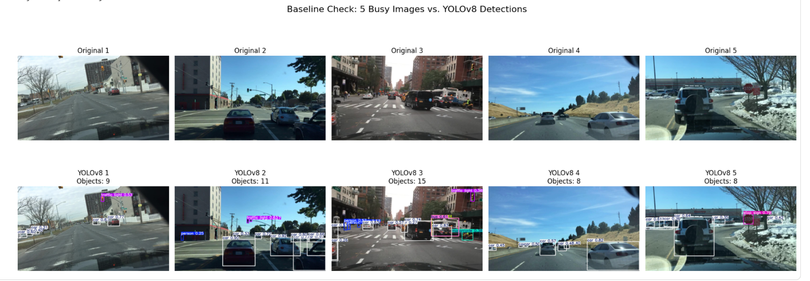
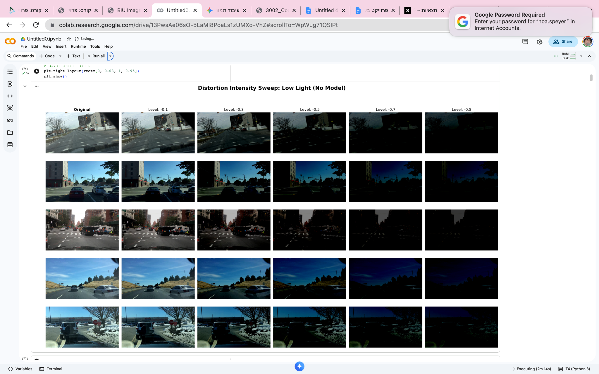
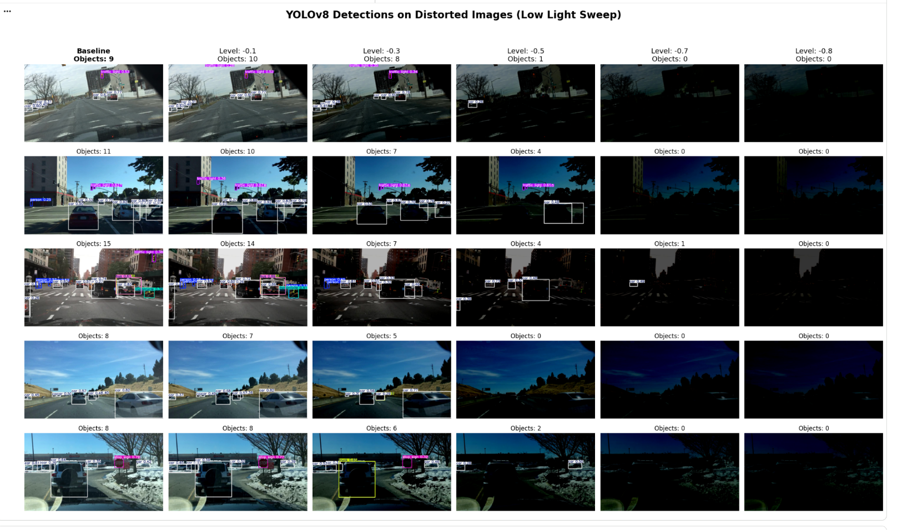
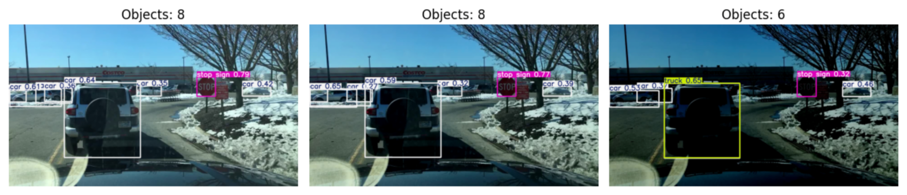
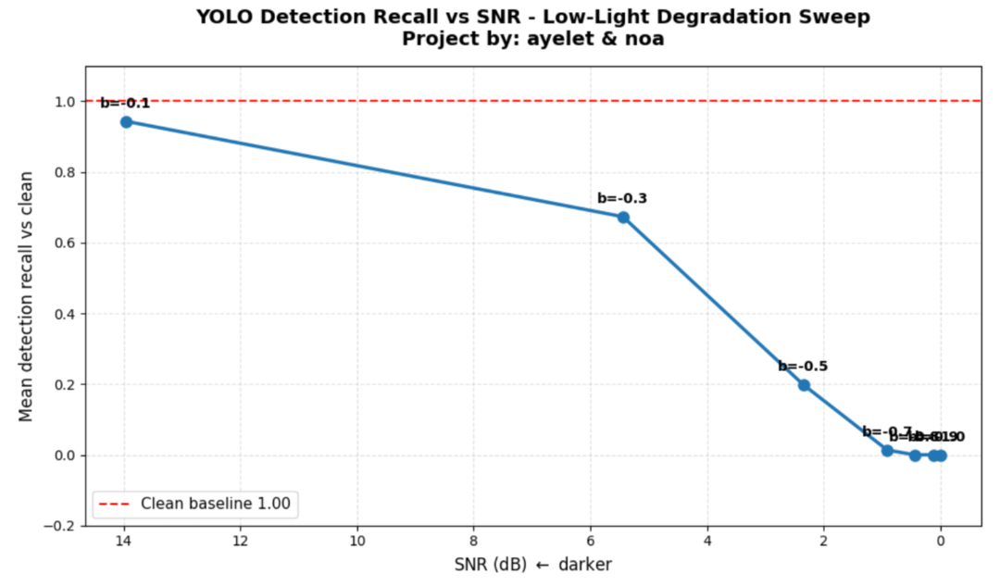
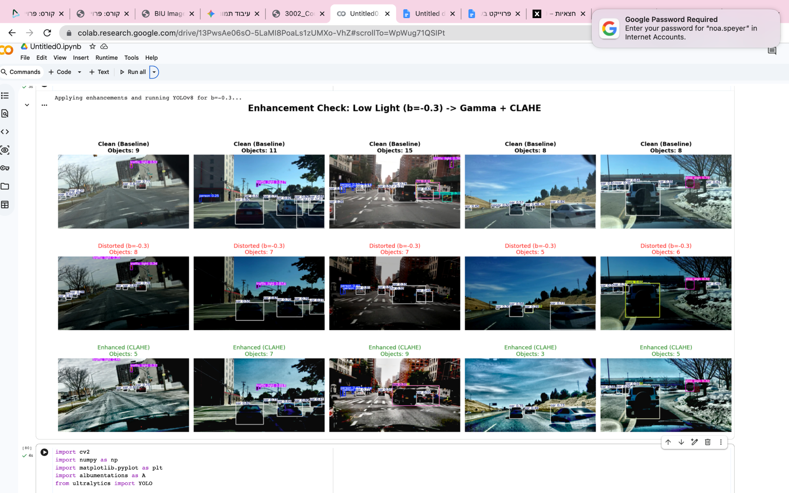
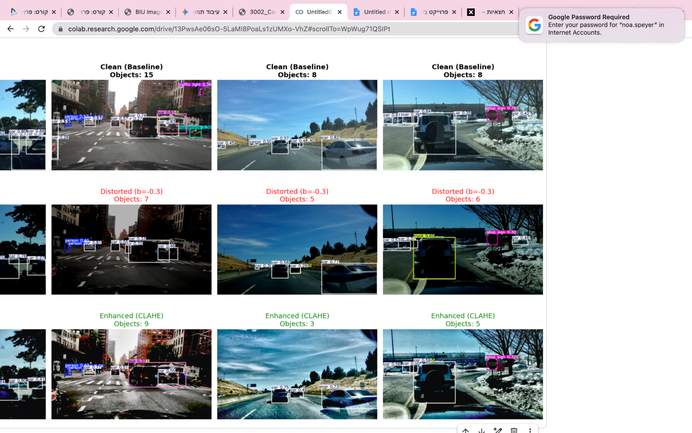
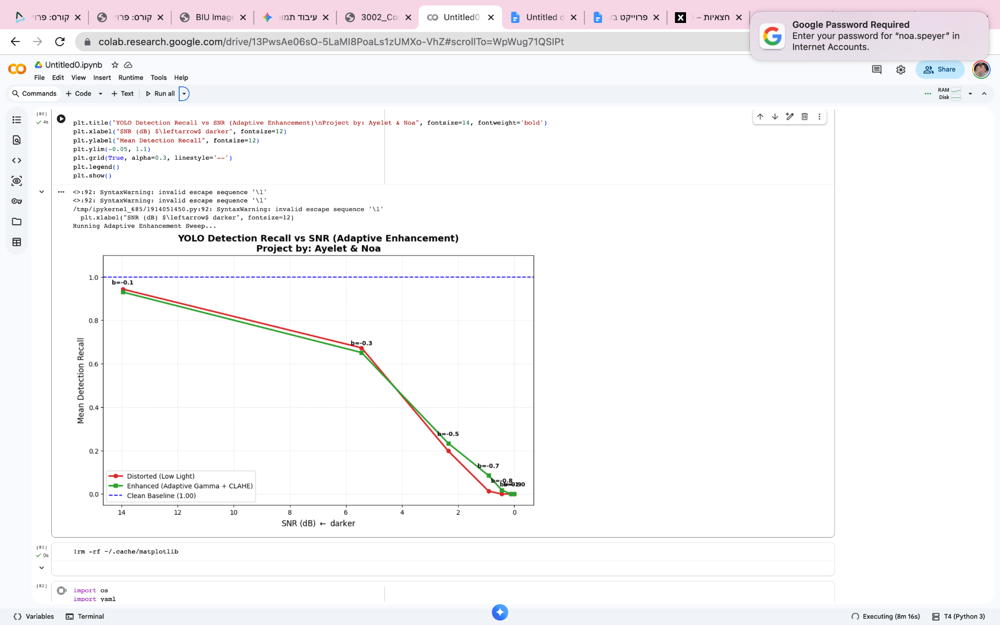
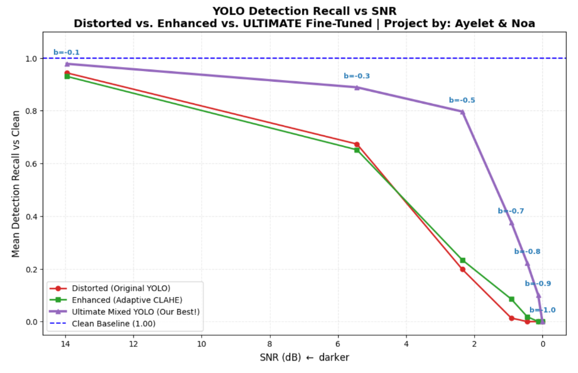
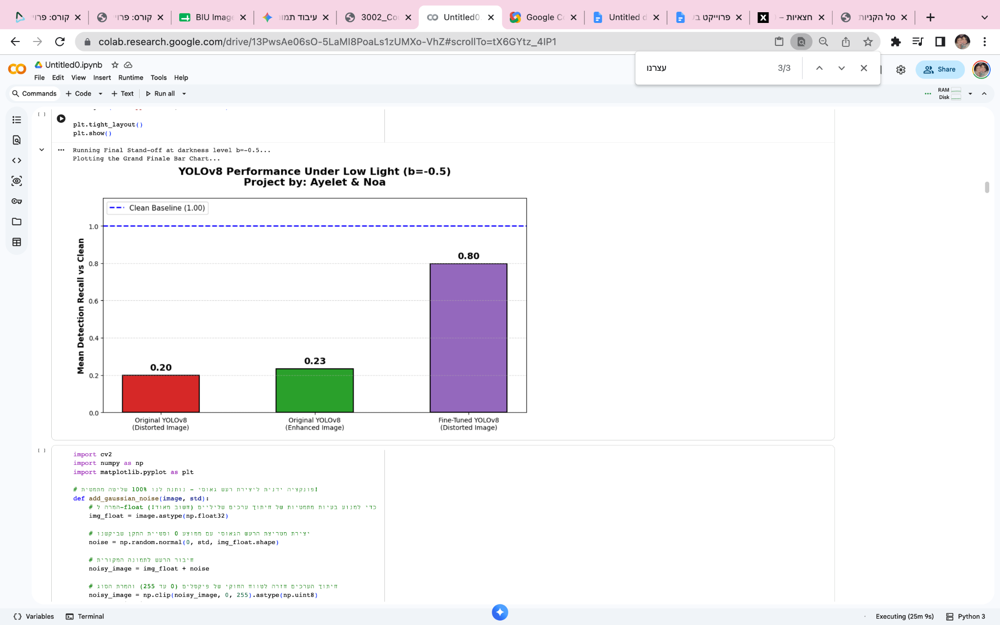

# Evaluating the Robustness of Computer Vision Models

**Project by Ayelet & Noa**

> **Project status:** Work in progress. This README currently contains the completed experimental sections. The remaining deep-learning extension will be added in a future update.

## 1. Project Objective

The primary objective of this project is to evaluate the robustness of classical image-processing algorithms and deep-learning-based computer vision models. In real-world applications, computer vision systems must operate in dynamic environments and handle changing, non-ideal imaging conditions, including poor illumination, sensor noise, and degradation caused by data compression. These factors may distort the input, alter the model output, and significantly reduce the reliability of the overall system.

To examine this challenge in a realistic and demanding setting, we used the **BDD100K** dataset, a large-scale collection of road-scene images captured by vehicle-mounted cameras. The dataset provides a suitable test environment for measuring model performance under three deliberately introduced image distortions.

After establishing each model's performance on clean images as a baseline, we measured the degradation caused by each distortion and evaluated two recovery strategies:

1. **Classical image enhancement**, applied as a preprocessing stage before model inference.
2. **Model fine-tuning**, in which a model is retrained on distorted data so that it can learn more robust internal representations.

The project therefore investigates not only how rapidly different models degrade, but also whether image-level restoration or model-level adaptation provides the more effective recovery strategy.

## 2. Selected Tasks and Models

To obtain a broad and meaningful comparison, we selected three computer vision tasks that represent substantially different levels of image analysis and scene understanding.

### Task 1: Object Detection with YOLOv8

Object detection performs classification and localization at the object level using bounding boxes. We selected **YOLOv8** to examine how a modern real-time detector handles the localization of discrete, safety-critical road elements, such as vehicles and pedestrians, under uncertain and degraded imaging conditions.

### Task 2: Instance Segmentation with Mask R-CNN

Instance segmentation performs pixel-level classification while separating individual object instances and outlining their precise boundaries. We selected **Mask R-CNN** to determine whether dense, fine-grained separation of objects from the background degrades differently from the coarser bounding-box-based localization used in object detection.

### Task 3: Monocular Depth Estimation with MiDaS

Monocular depth estimation is a continuous regression task that extracts relative three-dimensional scene structure from a single two-dimensional image. We selected **MiDaS** because depth estimation depends strongly on structural cues such as object contours, shadows, surface continuity, and linear perspective. This task is therefore particularly sensitive to lighting changes, damaged edges, and the loss of smooth spatial information.

## 3. Model-Selection Rationale

The models were selected to represent a broad range of modern computer vision architectures and feature-extraction mechanisms. Our working assumption was that each architecture would exhibit a different vulnerability profile under the tested distortions.

### Why YOLOv8?

YOLOv8 was selected to represent the family of **single-stage detectors** designed for real-time operation, as required in applications such as autonomous driving. Its anchor-free detection mechanism and efficient feature-extraction pipeline prioritize speed and practical deployment. This choice allowed us to investigate whether a model optimized for fast inference is especially sensitive to noise, low illumination, or compression artifacts that interfere with spatial features and object boundaries.

### Why Mask R-CNN?

Mask R-CNN was selected as a well-established, high-accuracy model for tasks requiring precise localization. Unlike YOLOv8, it follows a **two-stage architecture**: it first generates region proposals and then analyzes the selected regions at a higher resolution to classify objects and produce instance masks. This architecture provides a useful contrast to YOLOv8 and enables us to test whether two-stage processing and dense pixel-level predictions provide greater robustness under degraded visual conditions.

### Why MiDaS?

The central challenge in monocular depth estimation is its dependence on structural cues such as contours, shadows, relative scale, texture gradients, and linear perspective. MiDaS was selected because it is designed to generalize depth relationships across diverse visual domains and datasets. We therefore used it to examine how a model that estimates continuous scene geometry responds when the visual cues supporting that geometry are deliberately corrupted.

## 4. Selected Distortions

We selected three distortions representing different physical and digital sources of image degradation.

### 4.1 Low-Light Distortion

Low-light distortion reduces image brightness while largely preserving the original geometric arrangement of the pixels. Its purpose is to evaluate model robustness under severe illumination changes, such as nighttime driving, twilight, underexposure, or insufficient camera exposure.

### 4.2 Gaussian Noise

Gaussian noise is a high-frequency distortion that adds random intensity variations across the image. It is used to approximate sensor noise and to test how the models respond when smooth surfaces, textures, and object boundaries are disrupted by random pixel-level interference.

### 4.3 JPEG Compression

JPEG compression is a lossy digital distortion that removes image information and may introduce blocking, color quantization, and artificial boundaries at aggressive compression levels. It enables us to investigate how the models respond when the original image geometry and fine visual details are damaged by compression artifacts.

## 5. Experimental Pipeline and Methodology

For each task and model, we followed a consistent experimental pipeline:

1. **Baseline evaluation:** The pretrained model was evaluated on clean images to establish a reference performance level.
2. **Distortion-intensity sweep:** Each distortion was applied at several increasing intensity levels to measure the model's rate of degradation and identify possible failure points.
3. **Classical enhancement:** Image-processing techniques, including methods such as CLAHE, bilateral filtering, Gaussian smoothing, and other distortion-specific filters, were applied before inference in an attempt to recover useful visual information.
4. **Fine-tuning:** Where applicable, the model was retrained on a dataset containing distorted samples so that it could learn to handle the degradation directly rather than relying only on external preprocessing.
5. **Evaluation and comparison:** The baseline, distorted, enhanced, and fine-tuned results were compared using task-appropriate quantitative metrics and qualitative visual analysis.

The following sections present each task in detail, including the baseline results, distortion sweeps, model degradation, classical enhancement methods, fine-tuning experiments where completed, and the main conclusions drawn from the results.

---

# 6. Task 1: Object Detection with YOLOv8

## 6.1 Baseline Evaluation

The first experimental task evaluated the pretrained **YOLOv8** object-detection model in order to establish the clean-image baseline used throughout the rest of the analysis. Five images were selected from the **BDD100K** dataset. The selected scenes represent visually busy and diverse driving environments, ranging from highways to dense urban intersections containing multiple relevant road users and traffic elements.

The model successfully detected a broad range of safety-critical objects, including vehicles, pedestrians, traffic lights, and traffic signs, while producing bounding boxes with generally high confidence scores. The number of detected objects varied from four objects in relatively sparse scenes to fourteen objects in more complex urban scenes.

These clean-image detections serve as the experimental reference for the selected images. All later degradation is measured relative to the objects detected by the same pretrained model on the corresponding clean images. In this context, the baseline detections are used as a reference set rather than as manually annotated ground-truth labels.

  

<em>YOLOv8 detections on the five clean BDD100K test images.</em>

## 6.2 Distortion 1: Low-Light Conditions

The first distortion was designed to simulate poor driving visibility caused by twilight, nighttime conditions, severe underexposure, or insufficient camera exposure. Unlike distortions that introduce new spatial structures, low-light degradation primarily attenuates the original visual signal. The geometric arrangement of the scene remains unchanged, but the contrast, color information, and visibility of object boundaries are progressively reduced.

To generate the distortion in a controlled and reproducible manner, brightness manipulation was applied at five increasing severity levels:

- `b = -0.1`
- `b = -0.3`
- `b = -0.5`
- `b = -0.7`
- `b = -0.8`

The sequence ranges from mild attenuation to near-total darkness.

### 6.2.1 Visual Distortion Sweep

The following figure shows the five clean test images under the selected low-light levels. At the lower distortion levels, the overall geometry and dominant scene elements remain visible. As the brightness reduction becomes more severe, the pixel values are compressed toward black and fine visual information gradually disappears.

At `b = -0.7` and `b = -0.8`, most of the visible signal is lost. Vehicles and background elements merge into dark silhouettes, producing a difficult feature-extraction problem for the detector.

  

<em>Low-light distortion sweep without model inference.</em>

### 6.2.2 YOLOv8 Performance under Increasing Darkness

The following figure presents the detections produced by YOLOv8 at the different low-light levels.

  

<em>YOLOv8 detections under increasing low-light distortion.</em>

The visual results reveal three central degradation patterns.

#### Recall Degradation

The model gradually loses the ability to detect objects. The process begins with small and distant objects, whose visual signatures are weaker even in the clean images. As the scene becomes darker, the detector also loses larger and more central vehicles. This behavior produces a substantial decrease in the total number of recovered baseline detections.

#### Confidence Degradation

Even when the model continues to detect an object, its confidence score decreases. Reduced illumination weakens the contrast and spatial gradients that help the convolutional feature extractor confirm object boundaries and internal appearance. As a result, detections that remain correct may become less certain and may eventually fall below the confidence threshold.

For example, in the parking-lot scene, the central vehicle is detected with a confidence of approximately `0.64` in the baseline image, compared with approximately `0.59` at the mild distortion level `b = -0.1`.

#### Misclassification caused by Feature Corruption

Under stronger low-light distortion, the model may not only miss objects but also classify an existing object incorrectly. Fine appearance cues such as windows, reflections, panel curvature, and color differences disappear into the dark background. The model is then forced to rely on coarse silhouettes and incomplete contextual information.

A clear example appears in the parking-lot scene. In the clean image, the foreground sport utility vehicle is correctly classified as a `car`. Under stronger attenuation, the internal visual details disappear while the dark, box-shaped silhouette and rear spare wheel remain visible. YOLOv8 then reclassifies the same vehicle as a `truck`.

  

<em>Example of a low-light-induced misclassification from car to truck.</em>

This example is important from a safety perspective. Environmental degradation does not only create false negatives by making the system blind to existing objects. It can also change the semantic interpretation of objects that remain visible.

### 6.2.3 Quantitative Recall Analysis

For the low-light experiment, the decrease in the signal-to-noise ratio does not result from the explicit addition of digital noise. Instead, it results from strong attenuation of the original visual signal. As the useful image content becomes weaker, background sensor noise and quantization effects become more significant relative to the remaining signal.

To quantify the degradation, the mean detection recall was measured relative to the clean-image baseline detections. The horizontal axis presents the signal-to-noise ratio in decibels, while the vertical axis presents the fraction of baseline objects successfully recovered by the model.

  

<em>Mean detection recall as a function of SNR under low-light degradation.</em>

The curve shows three main operating regions.

#### Initial Sensitivity

At the mild level `b = -0.1`, corresponding to an SNR of approximately `14 dB`, the mean recall is close to `0.95` rather than a perfect `1.0`. This small reduction demonstrates that the detector is not completely invariant even to mild pixel-level perturbations. Objects detected near the confidence threshold in the clean image may disappear after a relatively small reduction in illumination.

#### Knee Point and Rapid Degradation

Near `b = -0.3`, corresponding to an SNR of approximately `5.5 dB`, the recall decreases sharply to approximately `0.65`. This region represents a practical knee point in the degradation curve. Below this point, missing contrast and weakened edges increasingly prevent the detector from producing reliable spatial features.

At `b = -0.5`, corresponding to an SNR of approximately `2.5 dB`, the recall approaches `0.20`. Most baseline detections are no longer recovered.

#### Complete Failure

At the extreme levels `b = -0.7` and `b = -0.8`, recall approaches zero. The image no longer contains sufficient distinguishable signal for separating objects from the background. The failure is therefore not merely a confidence reduction but a near-total loss of detection capability.

The quantitative results confirm that the object detector is strongly dependent on visible spatial structure. Once illumination falls below a critical threshold, the remaining pixel information is insufficient to activate stable object features.

## 6.3 Classical Enhancement: Gamma Correction and CLAHE

The next stage evaluated whether classical image preprocessing could recover YOLOv8 detections under low-light conditions. The selected enhancement pipeline applied:

1. **Gamma correction**, to increase global brightness.
2. **Contrast Limited Adaptive Histogram Equalization (CLAHE)**, to increase local contrast in different regions of the image.

The intended purpose of this pipeline was to reconstruct local intensity differences that had been weakened by darkness before passing the image to YOLOv8.

### 6.3.1 Visual Comparison

The following figure compares clean images, images distorted at `b = -0.3`, and the corresponding enhanced images.

  

<em>Clean, distorted, and Gamma-plus-CLAHE-enhanced detection results.</em>

The enhancement creates a clear trade-off. It restores brightness and local contrast, but it may also amplify background noise, create unnatural textures, and modify useful visual features.

The parking-lot scene illustrates this behavior particularly well.

  

<em>Case study of the clean, distorted, and enhanced parking-lot scene.</em>

In the clean image, the foreground vehicle is correctly identified as a `car` with a confidence of approximately `0.64`, and eight objects are detected in the scene.

After applying the low-light distortion at `b = -0.3`, internal details of the vehicle disappear and the model classifies it as a `truck`. Several background vehicles are also lost, reducing the total number of detections to six.

After enhancement, the increased local contrast makes the vehicle windows and internal shape more visible. The classification is corrected from `truck` back to `car`. However, the recovery has a cost:

- The vehicle confidence decreases to approximately `0.56`.
- Artificial textures and amplified noise appear in the enhanced image.
- The total number of detections decreases further to five.

The enhancement therefore corrects one important foreground classification but does not improve the entire scene consistently. It restores some features while damaging or obscuring others.

### 6.3.2 Recall before and after Classical Enhancement

The following graph compares the raw low-light images with the Gamma-plus-CLAHE-enhanced images. The red curve represents YOLOv8 performance on the distorted images, while the green curve represents performance after enhancement. The dashed horizontal line represents the clean baseline.

  

<em>Mean detection recall before and after adaptive low-light enhancement.</em>

The comparison reveals three main regions.

#### High-SNR Region: Enhancement may be Harmful

Under mild and moderate darkness, approximately from `b = -0.1` to `b = -0.3`, the green curve overlaps the red curve or falls slightly below it. In this range, the original distorted image still contains useful gradients and recognizable object boundaries. Aggressive contrast enhancement does not create new semantic information. Instead, it may amplify sensor noise and introduce artificial local patterns that interfere with feature extraction.

#### Recovery Region: Enhancement becomes Useful

At stronger distortion levels, the green curve begins to exceed the red curve. At `b = -0.5`, for example, mean recall improves from approximately `0.20` to approximately `0.24`. When the original contrast is close to disappearing, adaptive enhancement can stretch the small remaining intensity differences and push some object signatures above the detector's activation and confidence thresholds.

#### Near-Zero-Signal Region: No Method can Reconstruct Missing Information

At the most extreme low-light levels, both curves converge toward zero. When the physical signal has almost completely disappeared, pixel-level enhancement cannot reconstruct the missing scene information. Increasing the intensity of nearly black pixels mainly amplifies noise rather than recovering real object structure.

The classical enhancement experiment therefore demonstrates that Gamma correction and CLAHE are not universal solutions. Their benefit depends on the distortion level. They may be harmful when the original image already contains sufficient information, modestly helpful near the detector's failure point, and ineffective when the useful signal has disappeared almost completely.

## 6.4 Deep-Learning-Based Improvement: Fine-Tuning on a Mixed Dataset

Because classical preprocessing produced an unavoidable trade-off between signal recovery and noise amplification, a data-driven recovery strategy was also evaluated.

Instead of modifying every low-light image before inference, a new mixed training dataset was created. It combined clean images with synthetically darkened images generated through data augmentation. YOLOv8 was then fine-tuned on this mixed dataset so that its internal weights could learn features that remain useful under poor illumination.

The goal was to reduce dependence on fine color and texture information and encourage the model to use more robust cues, including coarse contours, silhouettes, object scale, and scene context.

### 6.4.1 Three-Way Performance Comparison

The following graph compares three approaches:

- **Red curve:** the original YOLOv8 model on distorted images.
- **Green curve:** the original model after Gamma and CLAHE preprocessing.
- **Purple curve:** the fine-tuned YOLOv8 model evaluated directly on distorted images.

  

<em>Comparison of the original, classically enhanced, and fine-tuned YOLOv8 approaches.</em>

The fine-tuned model substantially shifts the failure point toward more severe darkness. At `b = -0.3`, the original and enhanced approaches fall to a recall of approximately `0.65`, while the fine-tuned model maintains a recall close to `0.90`.

The largest difference appears near `b = -0.5`, corresponding to an SNR of approximately `2.5 dB`. The original model and the classical-enhancement pipeline recover only approximately `0.20` to `0.24` of the baseline detections, whereas the fine-tuned model maintains a recall of approximately `0.80`.

This result shows that internal domain adaptation is substantially more effective than attempting to restore the input pixels externally. Through exposure to distorted data during training, the model learns a representation that is less dependent on clean-image brightness and color cues.

The fine-tuned model is not completely invariant to darkness. At the most severe distortion levels, where the SNR approaches zero, its performance also collapses. This limitation indicates that the final failure is caused not only by architecture or training strategy but by the physical absence of recoverable information in the input.

### 6.4.2 Critical Low-Light Comparison

The following bar chart summarizes the approaches at the critical distortion level `b = -0.5`.

  

<em>YOLOv8 performance comparison at the critical low-light level b = -0.5.</em>

At this operating point:

- The original YOLOv8 model achieves a recall of approximately `0.20`.
- Gamma and CLAHE preprocessing increases recall only slightly to approximately `0.23`.
- The fine-tuned YOLOv8 model reaches a recall of approximately `0.80`.

The improvement confirms that model-level adaptation provides the strongest and most stable solution for this experiment. Unlike external preprocessing, fine-tuning does not add an additional image-restoration stage during inference. Instead, the detector learns directly from examples of the target degradation.

## 6.5 Low-Light Experiment Conclusion

Low-light distortion significantly degrades YOLOv8 performance by weakening object boundaries, reducing confidence scores, eliminating detections, and occasionally causing incorrect classifications. Mild darkness produces limited degradation, but performance falls sharply after the SNR passes a critical knee point. Under near-total darkness, the model becomes unable to recover the baseline objects.

Gamma correction and CLAHE produce a distortion-dependent trade-off. They may amplify noise and reduce performance when the image still contains sufficient useful information. At stronger but not complete darkness, they can recover a small fraction of lost detections by restoring local contrast. They cannot, however, reconstruct information that is no longer present in the input.

Fine-tuning on a mixed dataset containing both clean and synthetically darkened images provides a substantially stronger solution. It delays the model's failure point and preserves high recall under conditions in which the original and classically enhanced approaches have nearly collapsed. The results therefore support a central conclusion of the project: for YOLOv8 under low-light distortion, adapting the model to the degraded domain is considerably more effective than relying only on external pixel-level enhancement.
