# Evaluating the Robustness of Computer Vision Models

**Project by Ayelet & Noa**

> **Project status:** Work in progress. This README currently contains the completed experimental sections. The remaining deep-learning extension will be added in a future update.

## Contents

- [Project Objective](#1-project-objective)
- [Selected Tasks and Models](#2-selected-tasks-and-models)
- [Model-Selection Rationale](#3-model-selection-rationale)
- [Selected Distortions](#4-selected-distortions)
- [Experimental Pipeline](#5-experimental-pipeline-and-methodology)
- [Task 1: YOLOv8 Object Detection](#6-task-1-object-detection-with-yolov8)
- [Task 2: Mask R-CNN Instance Segmentation](#7-task-2-instance-segmentation-with-mask-r-cnn)
- [Task 3: MiDaS Monocular Depth Estimation](#8-task-3-monocular-depth-estimation-with-midas)
- [Overall Conclusions](#9-overall-conclusions)
- [Current Limitations and Future Work](#10-current-limitations-and-future-work)

## 1. Project Objective

The primary objective of this project is to evaluate the robustness of classical image-processing algorithms and deep-learning-based computer vision models. In real-world applications, computer vision systems must operate in dynamic environments and handle changing, non-ideal imaging conditions, including poor illumination, sensor noise, and degradation caused by data compression. These factors may distort the input, alter the model output, and significantly reduce the reliability of the overall system.

To examine this challenge in a realistic and demanding setting, we used the **BDD100K** dataset, a large-scale collection of road-scene images captured by vehicle-mounted cameras. The dataset provides a suitable test environment for measuring model performance under three deliberately introduced image distortions.

After establishing each model's performance on clean images as a baseline, we measured the degradation caused by each distortion and evaluated two recovery strategies:

1. **Classical image enhancement**, applied as a preprocessing stage before model inference.
2. **Model fine-tuning**, in which a model is retrained on distorted data so that it can learn more robust internal representations.

The project therefore investigates not only how rapidly different models degrade, but also whether image-level restoration or model-level adaptation provides the more effective recovery strategy.

## 2. Selected Tasks and Models

To obtain a broad and meaningful comparison, we selected three computer vision tasks that represent substantially different levels of image analysis and scene understanding.

### Task 1: Object Detection with YOLOv8

Object detection performs classification and localization at the object level using bounding boxes. We selected **YOLOv8** to examine how a modern real-time detector handles the localization of discrete, safety-critical road elements, such as vehicles and pedestrians, under uncertain and degraded imaging conditions.

### Task 2: Instance Segmentation with Mask R-CNN

Instance segmentation performs pixel-level classification while separating individual object instances and outlining their precise boundaries. We selected **Mask R-CNN** to determine whether dense, fine-grained separation of objects from the background degrades differently from the coarser bounding-box-based localization used in object detection.

### Task 3: Monocular Depth Estimation with MiDaS

Monocular depth estimation is a continuous regression task that extracts relative three-dimensional scene structure from a single two-dimensional image. We selected **MiDaS** because depth estimation depends strongly on structural cues such as object contours, shadows, surface continuity, and linear perspective. This task is therefore particularly sensitive to lighting changes, damaged edges, and the loss of smooth spatial information.

## 3. Model-Selection Rationale

The models were selected to represent a broad range of modern computer vision architectures and feature-extraction mechanisms. Our working assumption was that each architecture would exhibit a different vulnerability profile under the tested distortions.

### Why YOLOv8?

YOLOv8 was selected to represent the family of **single-stage detectors** designed for real-time operation, as required in applications such as autonomous driving. Its anchor-free detection mechanism and efficient feature-extraction pipeline prioritize speed and practical deployment. This choice allowed us to investigate whether a model optimized for fast inference is especially sensitive to noise, low illumination, or compression artifacts that interfere with spatial features and object boundaries.

### Why Mask R-CNN?

Mask R-CNN was selected as a well-established, high-accuracy model for tasks requiring precise localization. Unlike YOLOv8, it follows a **two-stage architecture**: it first generates region proposals and then analyzes the selected regions at a higher resolution to classify objects and produce instance masks. This architecture provides a useful contrast to YOLOv8 and enables us to test whether two-stage processing and dense pixel-level predictions provide greater robustness under degraded visual conditions.

### Why MiDaS?

The central challenge in monocular depth estimation is its dependence on structural cues such as contours, shadows, relative scale, texture gradients, and linear perspective. MiDaS was selected because it is designed to generalize depth relationships across diverse visual domains and datasets. We therefore used it to examine how a model that estimates continuous scene geometry responds when the visual cues supporting that geometry are deliberately corrupted.

## 4. Selected Distortions

We selected three distortions representing different physical and digital sources of image degradation.

### 4.1 Low-Light Distortion

Low-light distortion reduces image brightness while largely preserving the original geometric arrangement of the pixels. Its purpose is to evaluate model robustness under severe illumination changes, such as nighttime driving, twilight, underexposure, or insufficient camera exposure.

### 4.2 Gaussian Noise

Gaussian noise is a high-frequency distortion that adds random intensity variations across the image. It is used to approximate sensor noise and to test how the models respond when smooth surfaces, textures, and object boundaries are disrupted by random pixel-level interference.

### 4.3 JPEG Compression

JPEG compression is a lossy digital distortion that removes image information and may introduce blocking, color quantization, and artificial boundaries at aggressive compression levels. It enables us to investigate how the models respond when the original image geometry and fine visual details are damaged by compression artifacts.

## 5. Experimental Pipeline and Methodology

For each task and model, we followed a consistent experimental pipeline:

1. **Baseline evaluation:** The pretrained model was evaluated on clean images to establish a reference performance level.
2. **Distortion-intensity sweep:** Each distortion was applied at several increasing intensity levels to measure the model's rate of degradation and identify possible failure points.
3. **Classical enhancement:** Image-processing techniques, including methods such as CLAHE, bilateral filtering, Gaussian smoothing, and other distortion-specific filters, were applied before inference in an attempt to recover useful visual information.
4. **Fine-tuning:** Where applicable, the model was retrained on a dataset containing distorted samples so that it could learn to handle the degradation directly rather than relying only on external preprocessing.
5. **Evaluation and comparison:** The baseline, distorted, enhanced, and fine-tuned results were compared using task-appropriate quantitative metrics and qualitative visual analysis.

The following sections present each task in detail, including the baseline results, distortion sweeps, model degradation, classical enhancement methods, fine-tuning experiments where completed, and the main conclusions drawn from the results.

---

# 6. Task 1: Object Detection with YOLOv8

## 6.1 Baseline Evaluation

The first experimental task evaluated the pretrained **YOLOv8** object-detection model in order to establish the clean-image baseline used throughout the rest of the analysis. Five images were selected from the **BDD100K** dataset. The selected scenes represent visually busy and diverse driving environments, ranging from highways to dense urban intersections containing multiple relevant road users and traffic elements.

The model successfully detected a broad range of safety-critical objects, including vehicles, pedestrians, traffic lights, and traffic signs, while producing bounding boxes with generally high confidence scores. The number of detected objects varied from four objects in relatively sparse scenes to fourteen objects in more complex urban scenes.

These clean-image detections serve as the experimental reference for the selected images. All later degradation is measured relative to the objects detected by the same pretrained model on the corresponding clean images. In this context, the baseline detections are used as a reference set rather than as manually annotated ground-truth labels.

  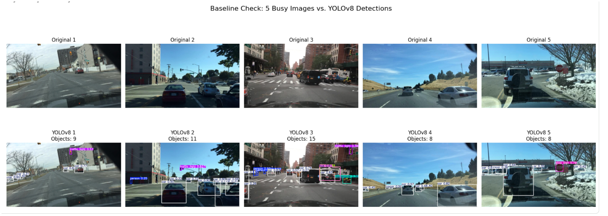

<em>YOLOv8 detections on the five clean BDD100K test images.</em>

## 6.2 Distortion 1: Low-Light Conditions

The first distortion was designed to simulate poor driving visibility caused by twilight, nighttime conditions, severe underexposure, or insufficient camera exposure. Unlike distortions that introduce new spatial structures, low-light degradation primarily attenuates the original visual signal. The geometric arrangement of the scene remains unchanged, but the contrast, color information, and visibility of object boundaries are progressively reduced.

To generate the distortion in a controlled and reproducible manner, brightness manipulation was applied at five increasing severity levels:

- `b = -0.1`
- `b = -0.3`
- `b = -0.5`
- `b = -0.7`
- `b = -0.8`

The sequence ranges from mild attenuation to near-total darkness.

### 6.2.1 Visual Distortion Sweep

The following figure shows the five clean test images under the selected low-light levels. At the lower distortion levels, the overall geometry and dominant scene elements remain visible. As the brightness reduction becomes more severe, the pixel values are compressed toward black and fine visual information gradually disappears.

At `b = -0.7` and `b = -0.8`, most of the visible signal is lost. Vehicles and background elements merge into dark silhouettes, producing a difficult feature-extraction problem for the detector.

  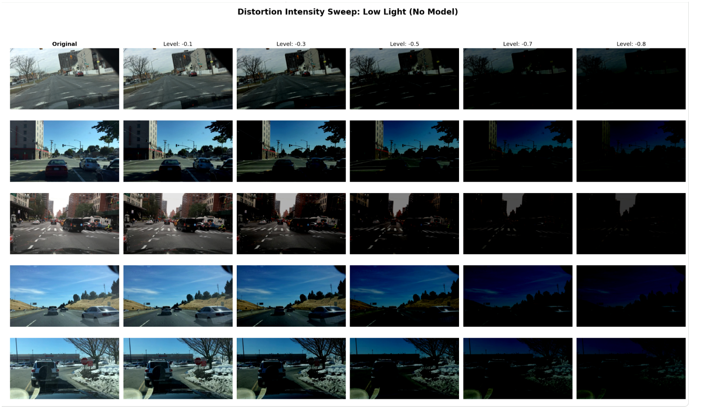

<em>Low-light distortion sweep without model inference.</em>

### 6.2.2 YOLOv8 Performance under Increasing Darkness

The following figure presents the detections produced by YOLOv8 at the different low-light levels.

  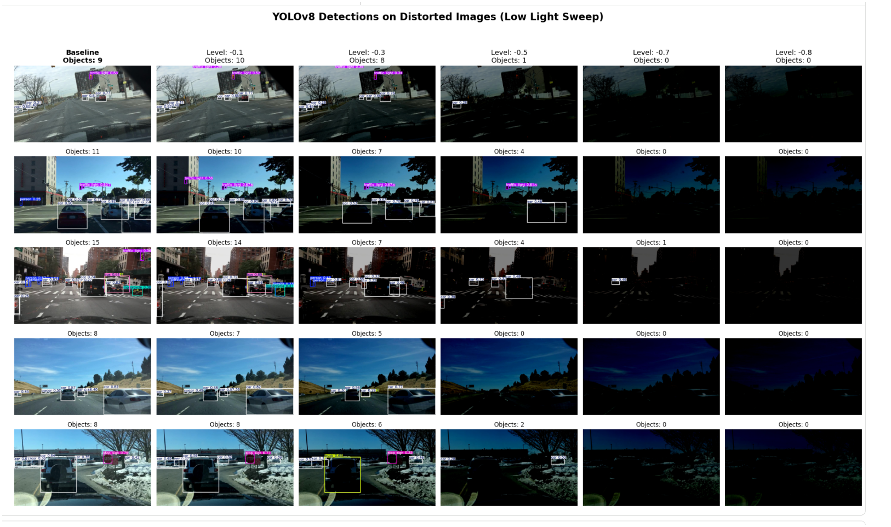

<em>YOLOv8 detections under increasing low-light distortion.</em>

The visual results reveal three central degradation patterns.

#### Recall Degradation

The model gradually loses the ability to detect objects. The process begins with small and distant objects, whose visual signatures are weaker even in the clean images. As the scene becomes darker, the detector also loses larger and more central vehicles. This behavior produces a substantial decrease in the total number of recovered baseline detections.

#### Confidence Degradation

Even when the model continues to detect an object, its confidence score decreases. Reduced illumination weakens the contrast and spatial gradients that help the convolutional feature extractor confirm object boundaries and internal appearance. As a result, detections that remain correct may become less certain and may eventually fall below the confidence threshold.

For example, in the parking-lot scene, the central vehicle is detected with a confidence of approximately `0.64` in the baseline image, compared with approximately `0.59` at the mild distortion level `b = -0.1`.

#### Misclassification caused by Feature Corruption

Under stronger low-light distortion, the model may not only miss objects but also classify an existing object incorrectly. Fine appearance cues such as windows, reflections, panel curvature, and color differences disappear into the dark background. The model is then forced to rely on coarse silhouettes and incomplete contextual information.

A clear example appears in the parking-lot scene. In the clean image, the foreground sport utility vehicle is correctly classified as a `car`. Under stronger attenuation, the internal visual details disappear while the dark, box-shaped silhouette and rear spare wheel remain visible. YOLOv8 then reclassifies the same vehicle as a `truck`.

  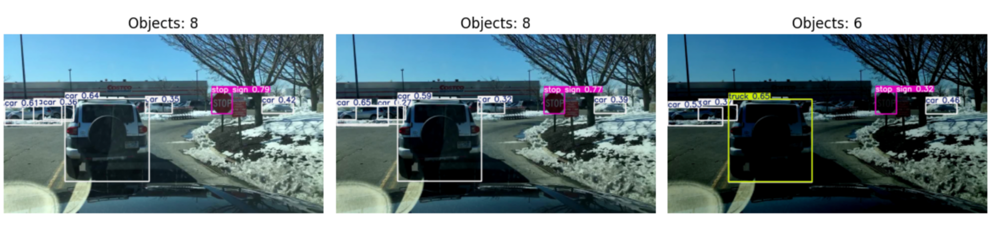

<em>Example of a low-light-induced misclassification from car to truck.</em>

This example is important from a safety perspective. Environmental degradation does not only create false negatives by making the system blind to existing objects. It can also change the semantic interpretation of objects that remain visible.

### 6.2.3 Quantitative Recall Analysis

For the low-light experiment, the decrease in the signal-to-noise ratio does not result from the explicit addition of digital noise. Instead, it results from strong attenuation of the original visual signal. As the useful image content becomes weaker, background sensor noise and quantization effects become more significant relative to the remaining signal.

To quantify the degradation, the mean detection recall was measured relative to the clean-image baseline detections. The horizontal axis presents the signal-to-noise ratio in decibels, while the vertical axis presents the fraction of baseline objects successfully recovered by the model.

  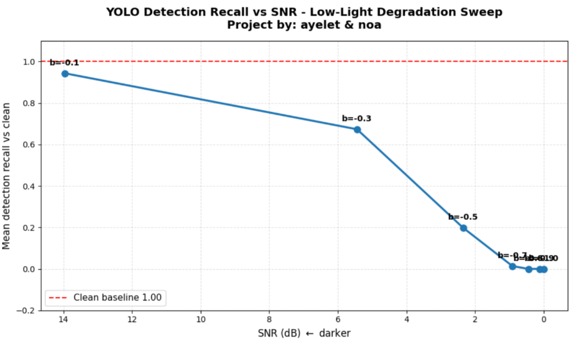

<em>Mean detection recall as a function of SNR under low-light degradation.</em>

The curve shows three main operating regions.

#### Initial Sensitivity

At the mild level `b = -0.1`, corresponding to an SNR of approximately `14 dB`, the mean recall is close to `0.95` rather than a perfect `1.0`. This small reduction demonstrates that the detector is not completely invariant even to mild pixel-level perturbations. Objects detected near the confidence threshold in the clean image may disappear after a relatively small reduction in illumination.

#### Knee Point and Rapid Degradation

Near `b = -0.3`, corresponding to an SNR of approximately `5.5 dB`, the recall decreases sharply to approximately `0.65`. This region represents a practical knee point in the degradation curve. Below this point, missing contrast and weakened edges increasingly prevent the detector from producing reliable spatial features.

At `b = -0.5`, corresponding to an SNR of approximately `2.5 dB`, the recall approaches `0.20`. Most baseline detections are no longer recovered.

#### Complete Failure

At the extreme levels `b = -0.7` and `b = -0.8`, recall approaches zero. The image no longer contains sufficient distinguishable signal for separating objects from the background. The failure is therefore not merely a confidence reduction but a near-total loss of detection capability.

The quantitative results confirm that the object detector is strongly dependent on visible spatial structure. Once illumination falls below a critical threshold, the remaining pixel information is insufficient to activate stable object features.

## 6.3 Classical Enhancement: Gamma Correction and CLAHE

The next stage evaluated whether classical image preprocessing could recover YOLOv8 detections under low-light conditions. The selected enhancement pipeline applied:

1. **Gamma correction**, to increase global brightness.
2. **Contrast Limited Adaptive Histogram Equalization (CLAHE)**, to increase local contrast in different regions of the image.

The intended purpose of this pipeline was to reconstruct local intensity differences that had been weakened by darkness before passing the image to YOLOv8.

### 6.3.1 Visual Comparison

The following figure compares clean images, images distorted at `b = -0.3`, and the corresponding enhanced images.

  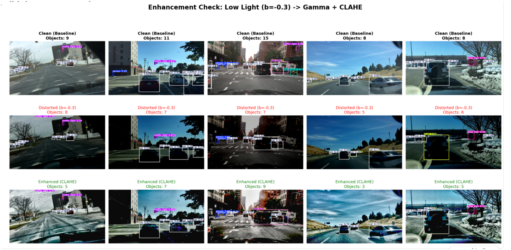

<em>Clean, distorted, and Gamma-plus-CLAHE-enhanced detection results.</em>

The enhancement creates a clear trade-off. It restores brightness and local contrast, but it may also amplify background noise, create unnatural textures, and modify useful visual features.

The parking-lot scene illustrates this behavior particularly well.

  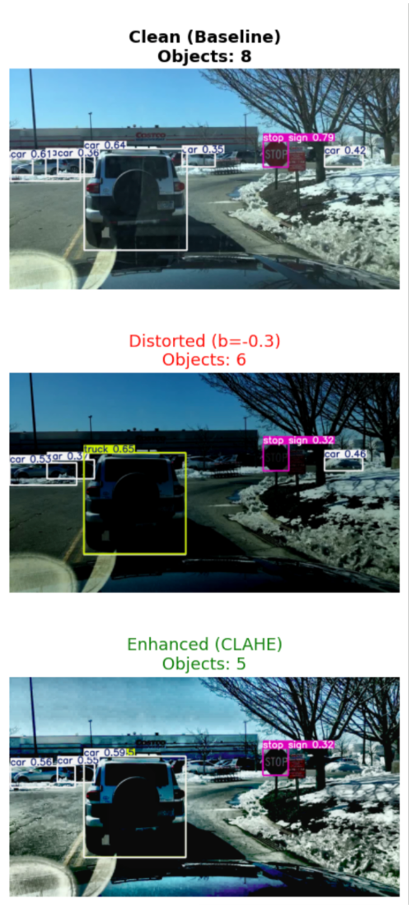

<em>Case study of the clean, distorted, and enhanced parking-lot scene.</em>

In the clean image, the foreground vehicle is correctly identified as a `car` with a confidence of approximately `0.64`, and eight objects are detected in the scene.

After applying the low-light distortion at `b = -0.3`, internal details of the vehicle disappear and the model classifies it as a `truck`. Several background vehicles are also lost, reducing the total number of detections to six.

After enhancement, the increased local contrast makes the vehicle windows and internal shape more visible. The classification is corrected from `truck` back to `car`. However, the recovery has a cost:

- The vehicle confidence decreases to approximately `0.56`.
- Artificial textures and amplified noise appear in the enhanced image.
- The total number of detections decreases further to five.

The enhancement therefore corrects one important foreground classification but does not improve the entire scene consistently. It restores some features while damaging or obscuring others.

### 6.3.2 Recall before and after Classical Enhancement

The following graph compares the raw low-light images with the Gamma-plus-CLAHE-enhanced images. The red curve represents YOLOv8 performance on the distorted images, while the green curve represents performance after enhancement. The dashed horizontal line represents the clean baseline.

  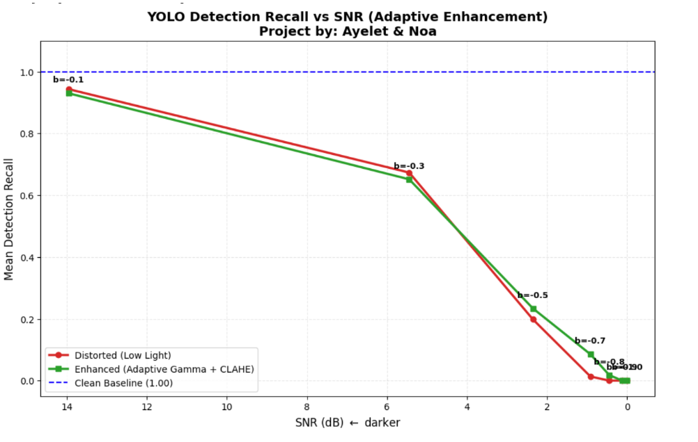

<em>Mean detection recall before and after adaptive low-light enhancement.</em>

The comparison reveals three main regions.

#### High-SNR Region: Enhancement may be Harmful

Under mild and moderate darkness, approximately from `b = -0.1` to `b = -0.3`, the green curve overlaps the red curve or falls slightly below it. In this range, the original distorted image still contains useful gradients and recognizable object boundaries. Aggressive contrast enhancement does not create new semantic information. Instead, it may amplify sensor noise and introduce artificial local patterns that interfere with feature extraction.

#### Recovery Region: Enhancement becomes Useful

At stronger distortion levels, the green curve begins to exceed the red curve. At `b = -0.5`, for example, mean recall improves from approximately `0.20` to approximately `0.24`. When the original contrast is close to disappearing, adaptive enhancement can stretch the small remaining intensity differences and push some object signatures above the detector's activation and confidence thresholds.

#### Near-Zero-Signal Region: No Method can Reconstruct Missing Information

At the most extreme low-light levels, both curves converge toward zero. When the physical signal has almost completely disappeared, pixel-level enhancement cannot reconstruct the missing scene information. Increasing the intensity of nearly black pixels mainly amplifies noise rather than recovering real object structure.

The classical enhancement experiment therefore demonstrates that Gamma correction and CLAHE are not universal solutions. Their benefit depends on the distortion level. They may be harmful when the original image already contains sufficient information, modestly helpful near the detector's failure point, and ineffective when the useful signal has disappeared almost completely.

## 6.4 Deep-Learning-Based Improvement: Fine-Tuning on a Mixed Dataset

Because classical preprocessing produced an unavoidable trade-off between signal recovery and noise amplification, a data-driven recovery strategy was also evaluated.

Instead of modifying every low-light image before inference, a new mixed training dataset was created. It combined clean images with synthetically darkened images generated through data augmentation. YOLOv8 was then fine-tuned on this mixed dataset so that its internal weights could learn features that remain useful under poor illumination.

The goal was to reduce dependence on fine color and texture information and encourage the model to use more robust cues, including coarse contours, silhouettes, object scale, and scene context.

### 6.4.1 Three-Way Performance Comparison

The following graph compares three approaches:

- **Red curve:** the original YOLOv8 model on distorted images.
- **Green curve:** the original model after Gamma and CLAHE preprocessing.
- **Purple curve:** the fine-tuned YOLOv8 model evaluated directly on distorted images.

  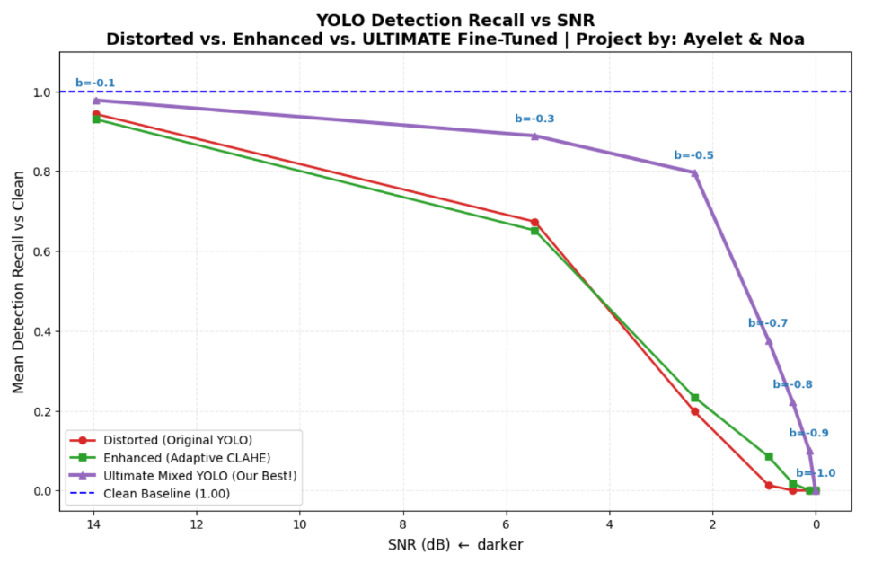

<em>Comparison of the original, classically enhanced, and fine-tuned YOLOv8 approaches.</em>

The fine-tuned model substantially shifts the failure point toward more severe darkness. At `b = -0.3`, the original and enhanced approaches fall to a recall of approximately `0.65`, while the fine-tuned model maintains a recall close to `0.90`.

The largest difference appears near `b = -0.5`, corresponding to an SNR of approximately `2.5 dB`. The original model and the classical-enhancement pipeline recover only approximately `0.20` to `0.24` of the baseline detections, whereas the fine-tuned model maintains a recall of approximately `0.80`.

This result shows that internal domain adaptation is substantially more effective than attempting to restore the input pixels externally. Through exposure to distorted data during training, the model learns a representation that is less dependent on clean-image brightness and color cues.

The fine-tuned model is not completely invariant to darkness. At the most severe distortion levels, where the SNR approaches zero, its performance also collapses. This limitation indicates that the final failure is caused not only by architecture or training strategy but by the physical absence of recoverable information in the input.

### 6.4.2 Critical Low-Light Comparison

The following bar chart summarizes the approaches at the critical distortion level `b = -0.5`.

  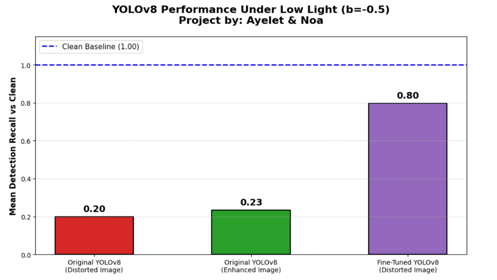

<em>YOLOv8 performance comparison at the critical low-light level b = -0.5.</em>

At this operating point:

- The original YOLOv8 model achieves a recall of approximately `0.20`.
- Gamma and CLAHE preprocessing increases recall only slightly to approximately `0.23`.
- The fine-tuned YOLOv8 model reaches a recall of approximately `0.80`.

The improvement confirms that model-level adaptation provides the strongest and most stable solution for this experiment. Unlike external preprocessing, fine-tuning does not add an additional image-restoration stage during inference. Instead, the detector learns directly from examples of the target degradation.

## 6.5 Low-Light Experiment Conclusion

Low-light distortion significantly degrades YOLOv8 performance by weakening object boundaries, reducing confidence scores, eliminating detections, and occasionally causing incorrect classifications. Mild darkness produces limited degradation, but performance falls sharply after the SNR passes a critical knee point. Under near-total darkness, the model becomes unable to recover the baseline objects.

Gamma correction and CLAHE produce a distortion-dependent trade-off. They may amplify noise and reduce performance when the image still contains sufficient useful information. At stronger but not complete darkness, they can recover a small fraction of lost detections by restoring local contrast. They cannot, however, reconstruct information that is no longer present in the input.

Fine-tuning on a mixed dataset containing both clean and synthetically darkened images provides a substantially stronger solution. It delays the model's failure point and preserves high recall under conditions in which the original and classically enhanced approaches have nearly collapsed. The results therefore support a central conclusion of the project: for YOLOv8 under low-light distortion, adapting the model to the degraded domain is considerably more effective than relying only on external pixel-level enhancement.

## 6.6 Distortion 2: Gaussian Noise

The second distortion examined the robustness of YOLOv8 under additive Gaussian noise, which was used to simulate high-frequency sensor noise and electronic interference. Unlike low-light degradation, which attenuates the original signal, Gaussian noise preserves the overall illumination level while adding random perturbations to the pixel values.

For every image, noise was sampled from a zero-mean Gaussian distribution and added independently to the image pixels. Five noise levels were evaluated:

- `STD = 10`
- `STD = 30`
- `STD = 60`
- `STD = 100`
- `STD = 150`

As the standard deviation increases, the random pixel variations become stronger and the signal-to-noise ratio decreases.

### 6.6.1 Visual Distortion Sweep

The following figure presents the five selected test images under the different Gaussian-noise intensities.

  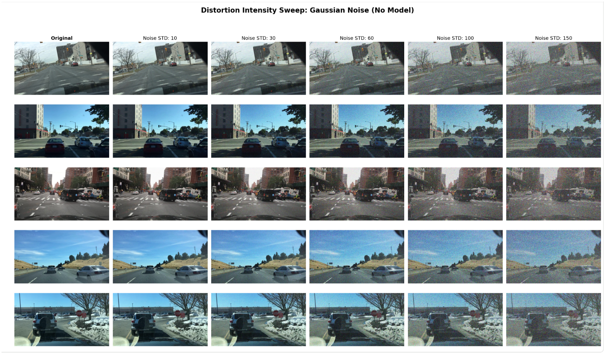

<em>Gaussian-noise distortion sweep without model inference.</em>

At low noise levels, the global scene geometry remains recognizable, although fine textures and object boundaries begin to fluctuate. As the noise level increases, the random high-frequency component masks local contrast and increasingly obscures vehicles, road markings, and small background objects.

At `STD = 100` and `STD = 150`, the noise becomes dominant over much of the original image content. The scene remains partially recognizable to a human observer, but the stable spatial patterns required by the detector are severely corrupted.

### 6.6.2 YOLOv8 Performance under Gaussian Noise

The following figure shows the detections produced by YOLOv8 across the Gaussian-noise sweep.

  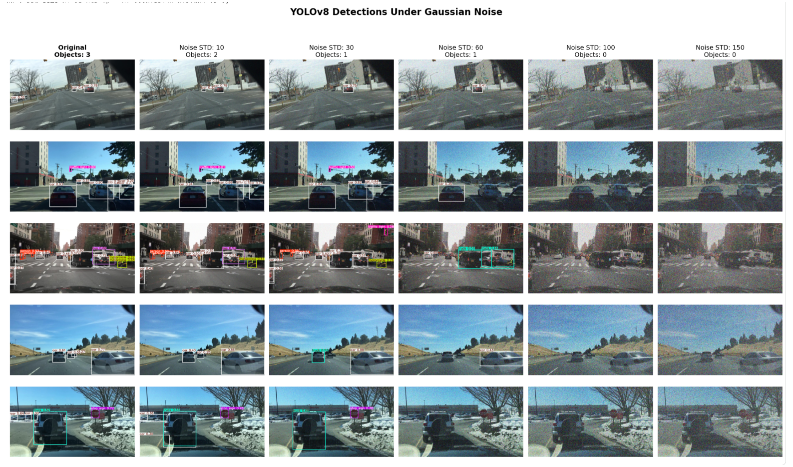

<em>YOLOv8 detections under increasing Gaussian-noise intensity.</em>

The results reveal three main failure modes.

#### Reduction in Detection Recall

Random noise masks edges and weakens local contrast, causing objects to merge into the surrounding background. Small and distant objects disappear first because their spatial signatures occupy fewer pixels and are therefore more easily overwhelmed by noise. As the standard deviation increases, larger foreground objects are also lost.

#### Confidence Degradation

The noisy pixels disrupt the smooth visual patterns that the feature extractor expects. Consequently, the convolutional activations become less stable and confidence scores decrease even for objects that remain correctly detected.

#### Noise-Induced Misclassification

At intermediate noise levels, corrupted textures may create a coarse pattern that resembles a different object class. The detector may therefore produce an incorrect classification before the object disappears completely.

The following sequence illustrates this progression in a highway scene.

  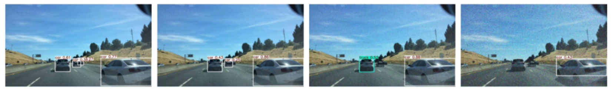

<em>Progressive detection loss and misclassification in a highway scene.</em>

In the clean image, YOLOv8 detects three vehicles, including a distant vehicle near the horizon. At `STD = 10`, the most distant vehicle disappears and the confidence of the central vehicle falls to approximately `0.43`.

At `STD = 30`, the noise corrupts the windows, curvature, and proportions of the central vehicle. The remaining coarse rectangular pattern is incorrectly classified as a `truck`. At `STD = 60`, this incorrect detection also disappears. The nearby white vehicle on the right survives longer because it occupies a larger image area and retains stronger contrast against the darker road.

At still higher noise levels, the model no longer detects the objects in this scene. This progression demonstrates that additive noise does not only reduce visibility. It can temporarily create misleading feature patterns that alter the semantic interpretation of the scene.

### 6.6.3 Quantitative Recall Analysis

For this distortion, the decrease in SNR is caused by the active addition of digital noise rather than by signal attenuation. The original image remains at the same nominal brightness, but the increasing Gaussian component masks a growing fraction of its useful visual structure.

The following graph presents mean detection recall relative to the clean-image baseline as a function of SNR. The red curve represents the original YOLOv8 model evaluated on the noisy images, while the dashed blue line represents the clean baseline.

  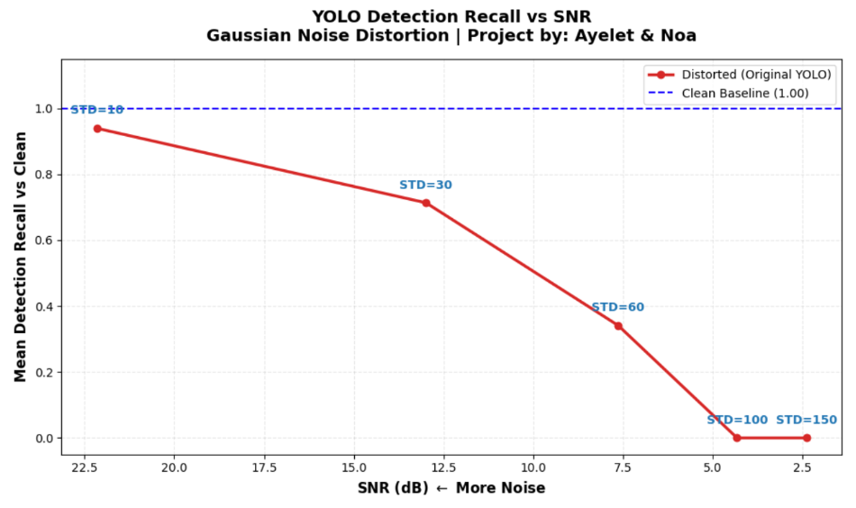

<em>Mean YOLOv8 detection recall as a function of SNR under Gaussian noise.</em>

At `STD = 10`, corresponding to an SNR of approximately `22 dB`, the model preserves a recall close to `0.95`. This result indicates that the pretrained detector has a degree of natural robustness to mild high-frequency perturbations.

The degradation is more gradual than in the low-light experiment. At `STD = 30`, corresponding to approximately `13 dB`, recall falls to around `0.70`. At `STD = 60`, corresponding to approximately `7.5 dB`, recall decreases to roughly `0.35`.

At `STD = 100` and `STD = 150`, where the SNR falls into the low single-digit range, recall approaches zero. At these levels, the random component dominates the local spatial features and the detector can no longer recover the baseline objects.

The experiment therefore shows that YOLOv8 can tolerate mild Gaussian noise, but its feature extraction fails progressively as the SNR enters the single-digit range.

## 6.7 Classical Enhancement: Bilateral Filtering

To determine whether classical denoising could reduce the degradation, a **bilateral filter** was applied before inference. Unlike standard Gaussian blur, which smooths the image uniformly, bilateral filtering combines spatial proximity with intensity similarity. Its purpose is to reduce random noise while preserving strong object boundaries.

The intended trade-off was to remove high-frequency pixel fluctuations without erasing the coarse vehicle contours needed by YOLOv8.

### 6.7.1 Recall before and after Bilateral Filtering

The following graph compares the original noisy images with the bilaterally filtered images. The red curve represents the distorted inputs, the green curve represents the enhanced inputs, and the dashed blue line represents the clean baseline.

  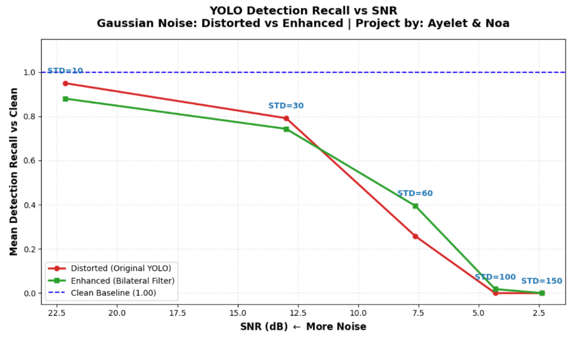

<em>Mean detection recall before and after bilateral denoising.</em>

The results reveal a distortion-dependent trade-off.

#### Low-Noise Region: Smoothing Penalty

At `STD = 10` and `STD = 30`, corresponding approximately to `SNR > 12 dB`, the green curve lies below the red curve. Although bilateral filtering is designed to preserve edges, it still suppresses fine textures and micro-gradients. Because YOLOv8 already tolerates mild noise reasonably well, removing these subtle details can harm the detection of small and distant objects.

#### Intermediate-Noise Region: Useful Denoising

Once the SNR falls below approximately `12 dB`, the curves cross. At `STD = 60`, the filtered images achieve a recall of approximately `0.40`, compared with approximately `0.25` to `0.35` for the unfiltered noisy images, depending on the evaluated noise realization.

At this point, the raw noise is sufficiently strong that the original detector can no longer ignore it. The bilateral filter removes enough of the random background variation to preserve some coarse object contours and recover detections that would otherwise be lost.

#### Extreme-Noise Region: Complete Failure

At `STD = 100` and `STD = 150`, both curves approach zero. When the noise amplitude becomes comparable to or larger than the original signal variations, filtering produces smoothed regions without reliable geometric structure. The information required for detection has already been destroyed, and classical denoising cannot reconstruct it.

Bilateral filtering is therefore not a universal correction. It is useful only within a limited noise range, after the raw detector begins to fail but before the original structure is completely overwhelmed.

## 6.8 Deep-Learning-Based Improvement: Fine-Tuning on Noisy Images

Because bilateral filtering damaged useful details at low noise levels and failed under extreme noise, a data-driven robustness strategy was evaluated.

YOLOv8 was fine-tuned on an augmented dataset containing Gaussian-noisy images. The objective was to make the network learn internal filters capable of distinguishing random high-frequency artifacts from genuine geometric edges, without requiring an external denoising stage.

### 6.8.1 Three-Way Performance Comparison

The following graph compares:

- **Red curve:** the original YOLOv8 model on noisy images.
- **Green curve:** the original model after bilateral filtering.
- **Purple curve:** the fine-tuned noise-robust model evaluated directly on noisy images.

  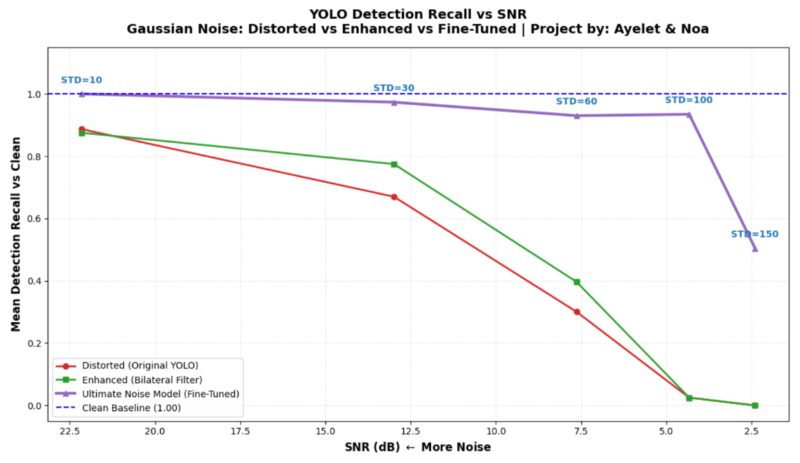

<em>Comparison of the original, bilaterally filtered, and fine-tuned models under Gaussian noise.</em>

At `STD = 10` and `STD = 30`, the fine-tuned model maintains a recall close to `0.98`. Unlike bilateral filtering, which removes some useful details, the adapted network learns to suppress the random perturbations within its internal representation while preserving the original image resolution.

The largest advantage appears at `STD = 60` and `STD = 100`, corresponding approximately to an SNR range of `5` to `7.5 dB`. In this region, the original and filtered approaches are severely degraded. At `STD = 100`, both approaches reach approximately zero recall, while the fine-tuned model remains above `0.90`.

Only at the extreme level `STD = 150`, corresponding to an SNR of approximately `2.5 dB`, does the fine-tuned model begin to break down, falling to approximately `0.50` recall. Even at this point, it remains substantially more effective than the other approaches, which failed at considerably lower noise intensities.

The results show that fine-tuning changes the model's feature space rather than attempting to reconstruct the corrupted pixels externally. This internal adaptation enables the detector to preserve object structure under noise levels that cause complete failure in the baseline model.

### 6.8.2 Critical Gaussian-Noise Comparison

The following bar chart summarizes the three approaches at `STD = 60`, a representative high-noise operating point.

  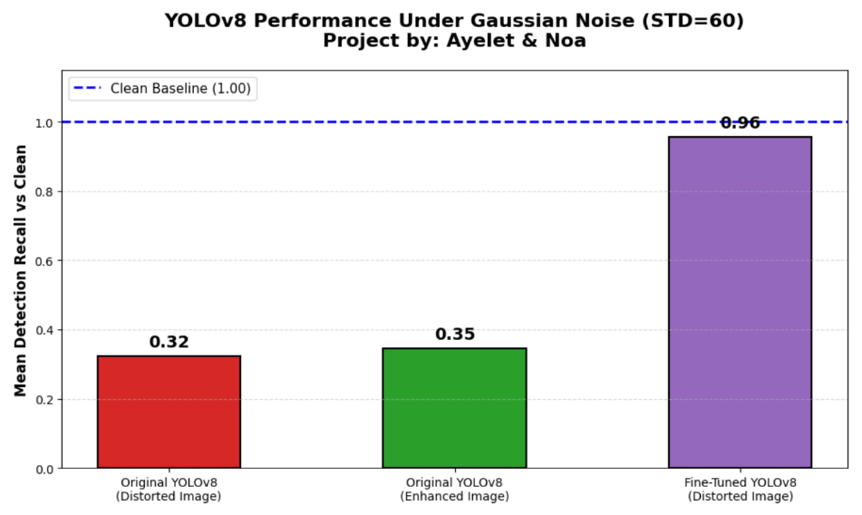

<em>YOLOv8 performance comparison at STD = 60.</em>

At this noise level:

- The original YOLOv8 model achieves a recall of approximately `0.32`.
- Bilateral filtering provides only a small improvement to approximately `0.35`.
- The fine-tuned YOLOv8 model achieves a recall of approximately `0.96`.

The bar chart confirms that external denoising offers only limited recovery, whereas training the detector on representative noisy data produces a major improvement without adding a preprocessing stage during inference.

## 6.9 Gaussian-Noise Experiment Conclusion

Gaussian noise causes a gradual degradation in YOLOv8 performance. Mild noise mainly removes small and distant detections, while stronger noise reduces confidence, produces occasional misclassifications, and eventually causes complete detection failure.

Bilateral filtering provides a narrow operating benefit. Under mild noise, it can reduce recall by oversmoothing useful details. At intermediate noise levels, it can recover a limited number of detections by suppressing random fluctuations while preserving coarse contours. Under extreme noise, it fails because the geometric information has already been destroyed.

Fine-tuning on noisy images is substantially more effective. The adapted model preserves near-baseline recall across low and moderate noise levels, remains highly accurate at noise levels that cause the other approaches to collapse, and begins to fail only under the most extreme corruption. For Gaussian noise, as in the low-light experiment, model-level domain adaptation is therefore considerably more robust than relying solely on classical input enhancement.

## 6.10 Distortion 3: Severe JPEG Compression

The third distortion evaluated the robustness of YOLOv8 under severe JPEG compression. This experiment represents communication failures, bandwidth limitations, or aggressive image-storage constraints in which road-scene frames are compressed using lossy quantization.

Unlike Gaussian noise, JPEG compression does not add independent random fluctuations to every pixel. Instead, it removes high-frequency information, groups nearby pixels into coarse regions, produces block boundaries, and may create artificial color transitions. These effects are especially harmful to small and distant objects because their visual signatures depend on fine edges and limited numbers of pixels.

The tested JPEG quality levels were:

- `Q = 30`
- `Q = 15`
- `Q = 8`
- `Q = 4`
- `Q = 1`

A lower quality value represents stronger compression and more severe information loss.

### 6.10.1 Visual Distortion Sweep

The following figure presents the five clean test images under the selected JPEG quality levels.

  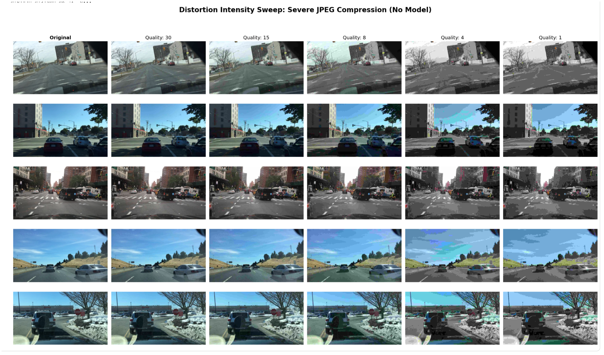

<em>Severe JPEG-compression sweep without model inference.</em>

At `Q = 30`, the global scene remains visually recognizable, although fine textures are already weakened. As the quality decreases, natural gradients are replaced by block-like boundaries and broad color regions. At `Q = 4` and `Q = 1`, the road scene becomes a coarse mosaic in which object contours, vehicle details, and color transitions are strongly distorted.

### 6.10.2 YOLOv8 Performance under JPEG Compression

The following figure presents YOLOv8 detections at each compression level.

  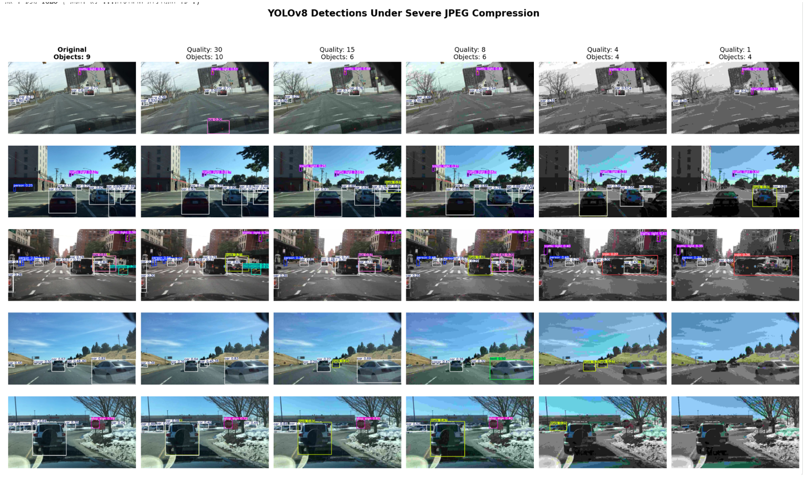

<em>YOLOv8 detections under increasingly severe JPEG compression.</em>

The visual results reveal three recurring failure mechanisms.

#### Detection-Recall Loss

JPEG quantization removes the micro-edges and fine textures required to detect small or distant objects. Vehicles near the horizon may become nearly uniform blocks whose color is similar to the road, causing false negatives.

#### Confidence Degradation

As compression becomes more severe, natural gradients are destroyed. Even when an object remains detectable, the model becomes less confident that the observed block-shaped pattern corresponds to a vehicle or traffic element.

#### Compression-Induced Hallucinations and Misclassifications

Artificial block boundaries may appear as strong but false edges. A random connection between a dark block and a neighboring color region may produce a pattern that resembles a structured object. The model can therefore produce duplicate boxes, inconsistent class labels, or incorrect classifications before the object disappears completely.

The following sequence highlights this behavior in the parking-lot scene.

  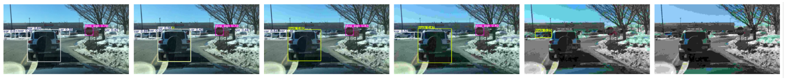

<em>Progressive confidence loss and class instability under JPEG compression.</em>

In the clean image, the central vehicle is classified as a `car` with a confidence of approximately `0.64`, while the stop sign is detected with a confidence of approximately `0.79`.

At `Q = 30`, the vehicle confidence falls to approximately `0.56`. The model also produces overlapping predictions and treats the same object as both a car and a truck. This behavior indicates that the feature representation has become ambiguous even though the scene is still visually understandable.

At `Q = 15`, the natural curves of the vehicle are replaced by coarse rectangular regions. The detector incorrectly resolves the ambiguity in favor of the `truck` class, with a confidence of approximately `0.60`. At the same time, more distant vehicles merge with the background and disappear.

At `Q = 8` and `Q = 4`, color banding and blocking artifacts become increasingly dominant. The confidence of the incorrect truck detection falls first to approximately `0.47` and then to approximately `0.23`. At `Q = 1`, the remaining object structure is nearly destroyed.

### 6.10.3 Quantitative Recall Analysis

For each quality level, the compressed images were compared with the clean images through their signal-to-noise ratio. In this experiment, the error represented by SNR is primarily **quantization error** rather than illumination attenuation or additive random noise.

The following graph presents mean detection recall relative to the clean-image reference detections.

  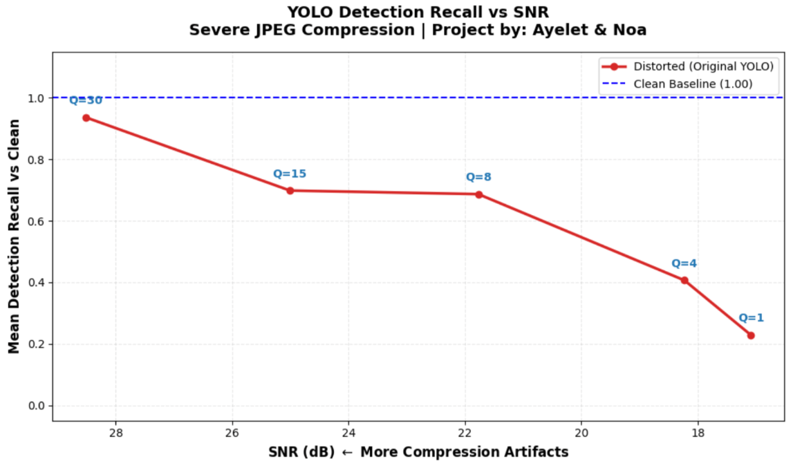

<em>Mean YOLOv8 detection recall as JPEG compression becomes more severe.</em>

At `Q = 30`, corresponding to approximately `28.5 dB`, recall remains high at roughly `0.94`. Nevertheless, the fact that recall is already below the clean baseline shows that convolutional detectors are sensitive to artificial high-frequency boundaries even under moderate compression.

At `Q = 15`, recall falls to approximately `0.70`. A plateau then appears between `Q = 15` and `Q = 8`, where performance remains relatively stable despite stronger compression. This behavior suggests that YOLOv8 can temporarily compensate for the loss of internal texture by relying on global silhouettes and coarse spatial context.

Below `Q = 8`, this structural defense fails. At `Q = 4`, recall drops sharply, and at `Q = 1` it reaches approximately `0.22`. At this stage, compression has destroyed not only texture but also the macroscopic geometry and color structure required for object detection.

The experiment therefore reveals a **plateau effect**: YOLOv8 shows meaningful robustness to intermediate JPEG compression as long as global object shape is preserved, followed by rapid failure once the geometry itself is corrupted.

## 6.11 Classical Enhancement: Bilateral De-Blocking

To reduce the block artifacts produced by JPEG compression, a bilateral filter was used as a classical preprocessing method. The filter combines spatial distance and color similarity, allowing it to smooth artificial transitions between neighboring blocks while attempting to preserve real object boundaries.

The objective was to use the bilateral filter as a de-blocking operator: artificial square boundaries should be reduced, while the continuous silhouette of each vehicle should remain available to the detector.

### 6.11.1 Recall before and after Bilateral Filtering

The following graph compares the original compressed images with the bilaterally filtered images. The red curve represents the compressed inputs, the green curve represents the enhanced inputs, and the dashed blue line represents the clean reference level.

  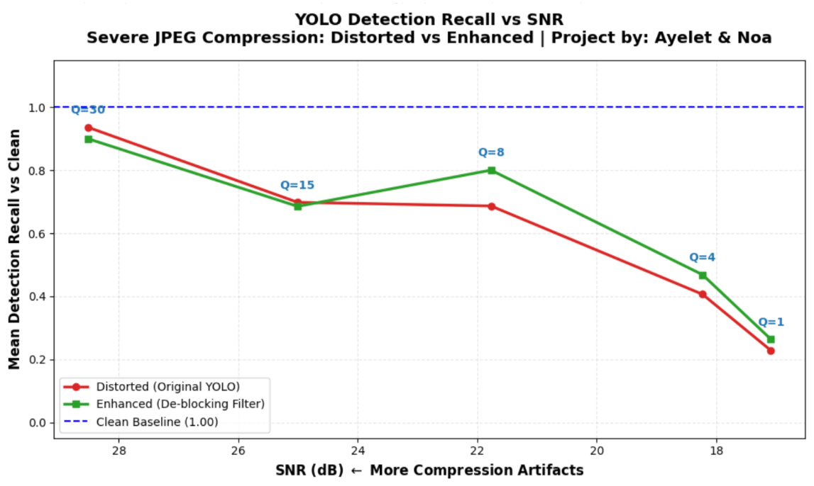

<em>Mean detection recall before and after bilateral de-blocking.</em>

At `Q = 30`, filtering slightly reduces performance. The image still contains useful textures and real micro-gradients, and unnecessary smoothing removes information that the detector could otherwise use.

At `Q = 15` and `Q = 8`, the filter becomes beneficial. At `Q = 8`, for example, mean recall increases from approximately `0.70` to approximately `0.80`. In this range, block boundaries are strong enough to confuse YOLOv8, but the underlying global object geometry still exists. The filter reduces the artificial square structure and reconnects parts of the vehicle silhouette.

At `Q = 4` and `Q = 1`, both methods fail rapidly. The original information loss is too severe, and smoothing the large color blocks merely produces broad, blurred regions without meaningful object geometry.

The bilateral filter therefore has a limited **sweet spot**. It is harmful when compression is mild, useful when block artifacts dominate but object shape remains recoverable, and ineffective after structural information has been destroyed.

## 6.12 Deep-Learning-Based Improvement: Fine-Tuning on JPEG-Compressed Images

Because classical de-blocking improved performance only within a narrow range, YOLOv8 was fine-tuned on an augmented dataset containing images compressed at multiple JPEG quality levels.

The objective was to teach the network to become less dependent on fragile micro-textures and more dependent on macroscopic geometric patterns that survive aggressive quantization. Rather than removing compression artifacts from the input, the adapted model learns to distinguish artificial block boundaries from meaningful object contours within its internal feature space.

### 6.12.1 Three-Way Comparison

The following graph compares:

- **Red curve:** original YOLOv8 on compressed images.
- **Green curve:** original YOLOv8 after bilateral de-blocking.
- **Purple curve:** the fine-tuned compression-robust model on compressed images.

  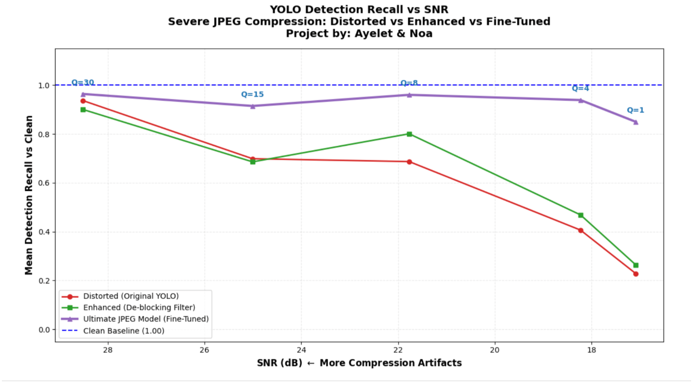

<em>Original, classically enhanced, and fine-tuned YOLOv8 performance under JPEG compression.</em>

The fine-tuned model almost eliminates the plateau-related loss observed in the baseline system. While the original and enhanced approaches fall to approximately `0.70` recall at `Q = 15`, the fine-tuned model remains above `0.90`.

At `Q = 8` and `Q = 4`, the performance gap becomes especially large. The fine-tuned model maintains recall close to `0.95`, demonstrating that it has learned to separate genuine object patterns from compression artifacts without explicitly restoring the image.

Only at the extreme quality level `Q = 1` does the fine-tuned curve begin to decline, reaching approximately `0.85`. Even at this point, its recall is more than three times higher than that of the original and classically enhanced models.

### 6.12.2 Summary across Compression Levels

The following grouped bar chart compares all three approaches at every tested quality level.

  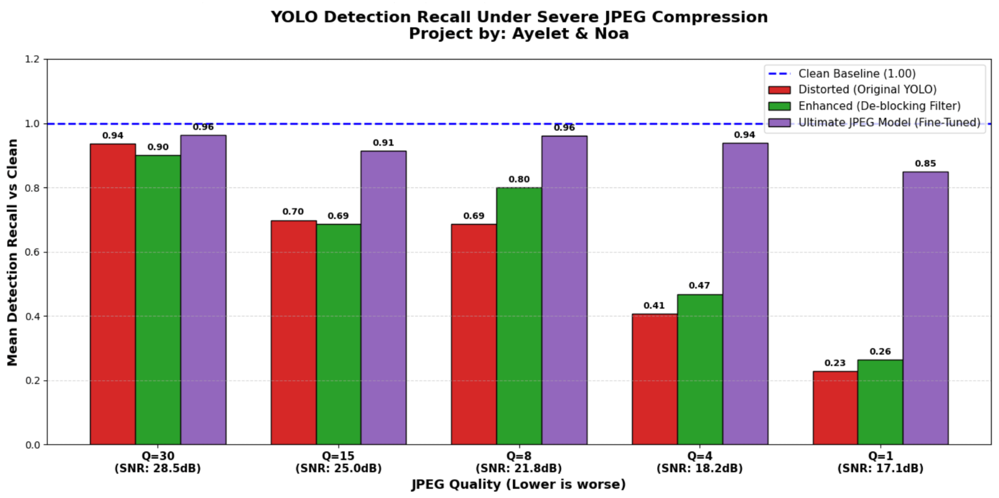

<em>Grouped comparison of YOLOv8 robustness across JPEG quality levels.</em>

The chart confirms that bilateral filtering produces only local improvements, whereas fine-tuning consistently preserves a substantially larger fraction of clean-image detections. Model adaptation is therefore the most reliable solution for severe and variable compression.

## 6.13 Task 1 Conclusion

The YOLOv8 experiments demonstrate that a detector trained mainly on clean data is vulnerable to all three tested distortions. Low light weakens the original signal, Gaussian noise injects high-frequency fluctuations, and JPEG compression removes or replaces high-frequency information through quantization. Although the physical mechanisms differ, all three distortions eventually damage the spatial features required for confident object detection.

Classical preprocessing offers only conditional improvement. Gamma correction and CLAHE can recover a small number of detections near the low-light failure point but may amplify noise under milder conditions. Bilateral filtering can suppress intermediate Gaussian noise or JPEG block artifacts but may remove useful details when the input quality is still relatively high. In all cases, classical enhancement exhibits a trade-off between removing the distortion and preserving the true visual signal.

Fine-tuning on representative distorted data produces the strongest and most stable improvement. The adapted models shift the knee point toward more severe corruption, preserve high recall over a much wider operating range, and avoid an additional preprocessing stage during inference. For real-time systems such as autonomous vehicles, the Task 1 results strongly support building robustness into the network weights rather than relying only on external image restoration.

---

# 7. Task 2: Instance Segmentation with Mask R-CNN

## 7.1 Task Overview

The second task evaluates **instance segmentation** using Mask R-CNN. Unlike object detection, which returns a bounding box around each detected object, instance segmentation predicts an individual pixel-level mask for every object instance.

The task is therefore more demanding in two ways. First, the model must determine whether an object exists and identify its class. Second, it must reconstruct the object's spatial shape and boundary with pixel-level precision. This dependency on local texture, edges, and contour continuity makes instance segmentation particularly sensitive to image degradation.

The pretrained Mask R-CNN model was evaluated on the same five selected BDD100K road scenes used throughout the project.

## 7.2 Clean Baseline

To create a stable baseline, the raw model output was processed using two additional stages:

1. **Non-Maximum Suppression (NMS)** with an IoU threshold of `0.3`, used to remove multiple overlapping detections of the same object and retain the prediction with the highest confidence.
2. **Ego-vehicle filtering**, used to remove detections associated with the hood or body of the camera vehicle. Predictions whose center fell within the bottom `15%` of the image were excluded.

These steps are particularly important in instance segmentation. Without NMS, multiple masks may overlap the same vehicle. Without ego-vehicle filtering, the model may assign masks to parts of the host vehicle rather than to the external driving environment.

  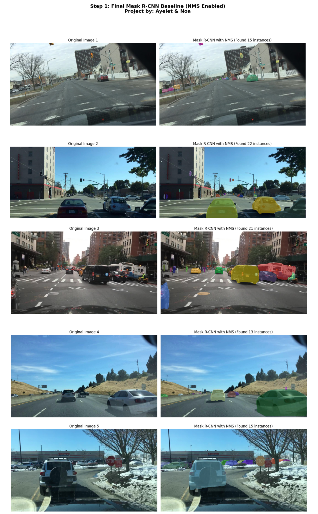

<em>Mask R-CNN baseline results after NMS and ego-vehicle filtering.</em>

The model produces clear masks for a broad range of road-scene objects, including cars, buses, pedestrians, motorcycles, and infrastructure elements. Across the five images, the average number of retained instances is `17.2` per image.

These results form the reference for the remaining Task 2 experiments. Later predictions are compared with the clean-model output to determine whether the same objects remain detectable and whether their spatial positions remain consistent.

Mask R-CNN provides richer geometric information than a bounding-box detector, but this benefit also creates a possible vulnerability: accurate masks depend on fine boundaries and local texture that may be weakened by darkness, noise, or compression.

## 7.3 Distortion 1: Low-Light Conditions

### 7.3.1 Distortion Sweep

The low-light distortion was generated using controlled brightness offsets without directly changing contrast. Five levels were evaluated:

- `b = -0.1`
- `b = -0.3`
- `b = -0.5`
- `b = -0.7`
- `b = -0.8`

  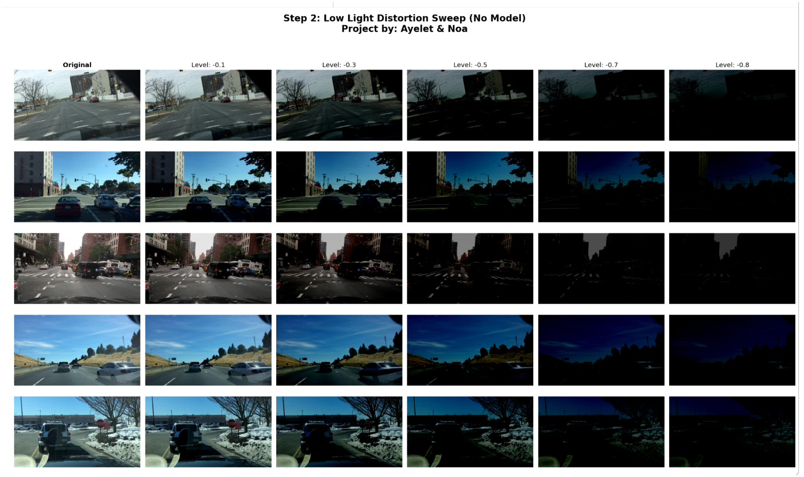

<em>Low-light distortion sweep used for the Mask R-CNN experiment.</em>

At mild levels, the global road structure, buildings, and vehicles remain visible. At `b = -0.7` and `b = -0.8`, much of the useful visual information is compressed toward black, and both small details and large structures become difficult to distinguish.

This distortion does not move the pixels or change the scene geometry. Instead, it weakens their intensity. Object boundaries remain in the correct location but generate much weaker gradients, which directly affects region proposal, classification, and mask prediction.

### 7.3.2 Mask R-CNN under Increasing Darkness

The same inference pipeline, including the confidence threshold, NMS, and ego-vehicle filter, was applied at every low-light level.

  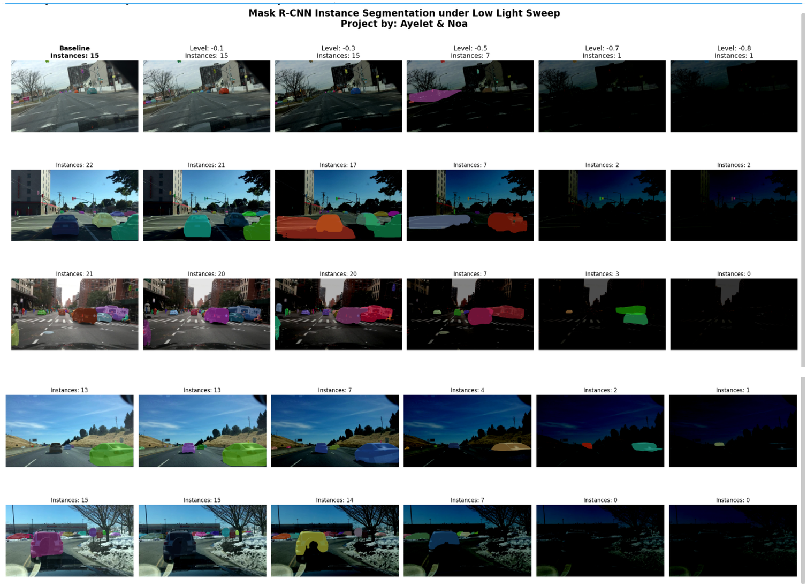

<em>Mask R-CNN instance masks under increasing darkness.</em>

As the image becomes darker, the number of detected objects decreases. In addition, the masks that remain become less precise: they may extend beyond the actual object, include neighboring regions, or represent only part of the object.

The average instance counts across the five images are:

| Condition | Average instances per image |
|---|---:|
| Clean baseline | 17.2 |
| `b = -0.1` | 16.8 |
| `b = -0.3` | 14.6 |
| `b = -0.5` | 6.4 |
| `b = -0.7` | 1.6 |
| `b = -0.8` | 0.8 |

The model is therefore almost unaffected by very mild darkness, but the degradation becomes rapid at stronger levels. At `b = -0.5`, only about one third of the baseline instances remain, and at the two most severe levels the system is nearly blind.

### 7.3.3 IoU-Matched Recall

To evaluate whether the baseline instances were recovered spatially, a prediction was considered a match when its IoU with a clean-image reference prediction was greater than `0.5`.

  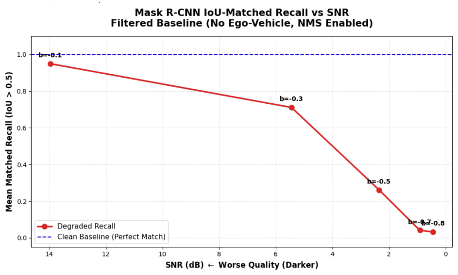

<em>IoU-matched instance recall under low-light degradation.</em>

At `b = -0.1`, recall remains close to `0.95`. At `b = -0.3`, it decreases to approximately `0.71`. The primary knee point occurs at `b = -0.5`, where recall falls to approximately `0.26`. At `b = -0.7` and `b = -0.8`, almost no matching masks remain.

The curve confirms that Mask R-CNN can tolerate mild attenuation but depends strongly on visible boundaries and local contrast when generating stable object regions.

## 7.4 Classical Enhancement for Low Light: Adaptive Gamma and CLAHE

An adaptive enhancement pipeline was designed using Gamma correction followed by CLAHE. Stronger correction parameters were applied to more severe darkness.

The procedure was:

1. Apply Gamma correction to increase the global brightness.
2. Convert the image to the LAB color space.
3. Apply CLAHE only to the luminance channel.
4. Preserve the remaining color channels without direct equalization.

The following graph compares the distorted images with the enhanced images. The red curve represents the unprocessed low-light inputs, and the green curve represents the adaptive enhancement pipeline.

  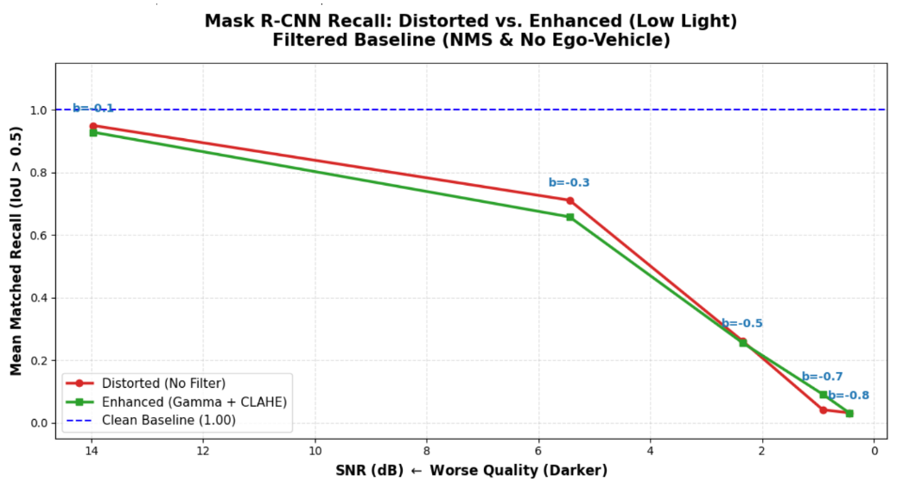

<em>Mask-recall comparison before and after adaptive Gamma and CLAHE enhancement.</em>

At mild and moderate darkness, the enhanced curve is slightly below the unprocessed curve. The filters alter texture and amplify background variation, which can damage the fine boundaries required for pixel-accurate masks. Enhancing a scene that has only been mildly darkened may therefore make segmentation less accurate than leaving the image unchanged.

Only at very severe darkness is a small benefit observed. Even then, recall remains extremely low. Classical enhancement does not meaningfully restore Mask R-CNN performance because the process cannot reconstruct all of the missing object boundaries.

### 7.4.1 Exploratory Alpha-Blending Analysis

The report also includes an exploratory experiment that blends the original distorted image and the fully enhanced image using different alpha values. This test examines whether a partial enhancement ratio can provide a better balance between recovering contrast and preserving natural texture.

  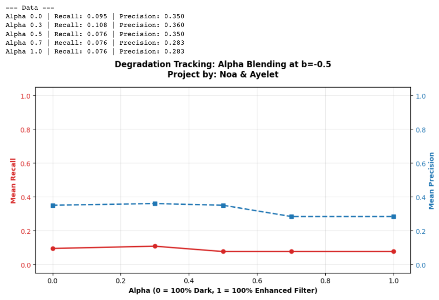

<em>Exploratory alpha-blending analysis at a severe low-light level.</em>

The associated visual inspection highlights a low-precision case in which the model produces a prediction in a poorly visible region.

  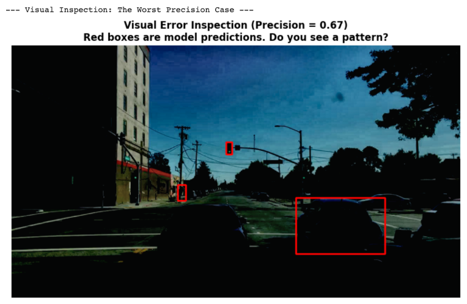

<em>Visual inspection of a low-light segmentation error.</em>

This alpha-blending experiment is included for completeness, but it is not treated as the final deep-learning improvement stage.

## 7.5 Deep-Learning-Based Improvement for Low Light

> **Work in progress:** the fine-tuning experiment for Mask R-CNN under low-light conditions has not yet been completed. This section will be added after the model-training stage is finalized.

## 7.6 Distortion 2: Gaussian Noise

Gaussian noise was used to simulate sensor noise, electronic interference, and random acquisition errors. Zero-mean Gaussian samples were added to the pixel values, followed by clipping to the valid `[0, 255]` range.

The tested standard deviations were:

- `STD = 10`
- `STD = 30`
- `STD = 60`
- `STD = 100`
- `STD = 150`

### 7.6.1 Visual Distortion Sweep

  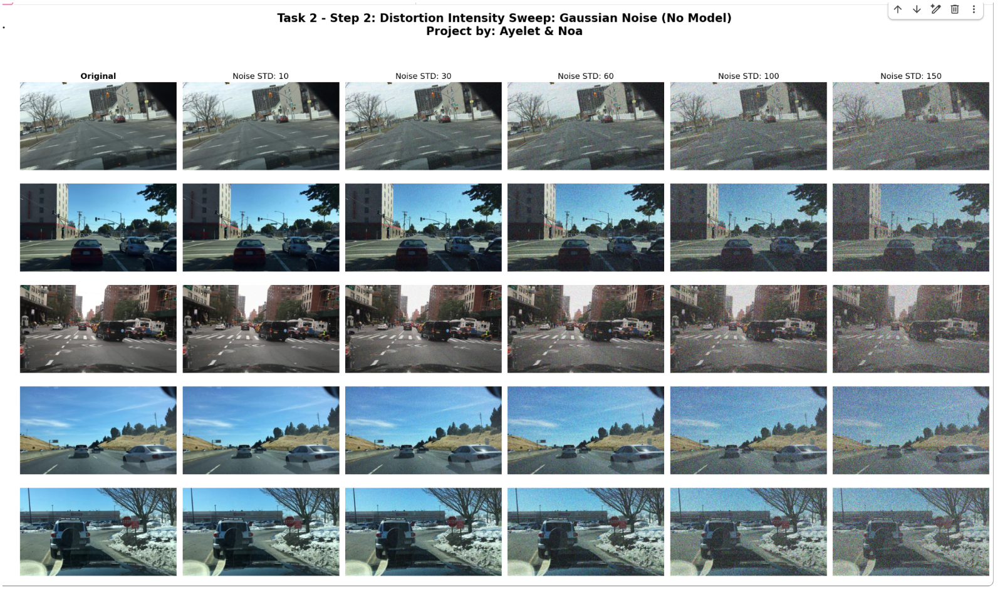

<em>Gaussian-noise sweep used for Mask R-CNN evaluation.</em>

At `STD = 10`, the road structure and major objects remain clear. At `STD = 30` and `STD = 60`, fine textures and small-object boundaries begin to mix with the background. At `STD = 100` and `STD = 150`, dense color noise makes it difficult to distinguish real boundaries from random pixel fluctuations.

### 7.6.2 Mask R-CNN under Gaussian Noise

  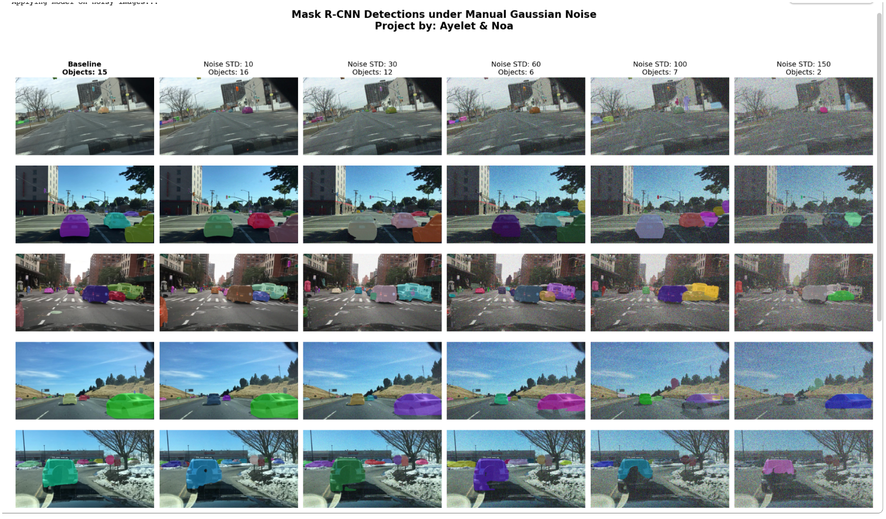

<em>Mask R-CNN predictions under increasing Gaussian noise.</em>

Under mild noise, the model still produces masks for many central objects. As the noise becomes stronger, small and distant objects disappear first. A small object is represented by relatively few pixels, so random corruption can hide a large fraction of its structure. Large foreground vehicles occupy a greater area and may survive longer.

Even when an object remains detected, its mask may become coarse, incomplete, or poorly aligned with the true boundary. High-frequency noise creates numerous artificial edges, making it harder for the segmentation branch to decide which pixels belong to the object and which belong to the background.

The number of predictions is not necessarily monotonic. For example, a noisy image may contain one more predicted instance than its clean baseline. This does not imply better performance. The additional prediction may be a false positive, a split object, or a borderline detection that happened to cross the confidence threshold.

## 7.7 Recall and Precision under Gaussian Noise

The quantitative evaluation compares the bounding boxes returned by Mask R-CNN on clean and noisy images. A match is defined by `IoU > 0.5`. The resulting metrics measure detection stability and localization rather than the full pixel-level accuracy of the masks.

The standard definitions are:

\[
\mathrm{Recall}=\frac{TP}{TP+FN}
\]

\[
\mathrm{Precision}=\frac{TP}{TP+FP}
\]

  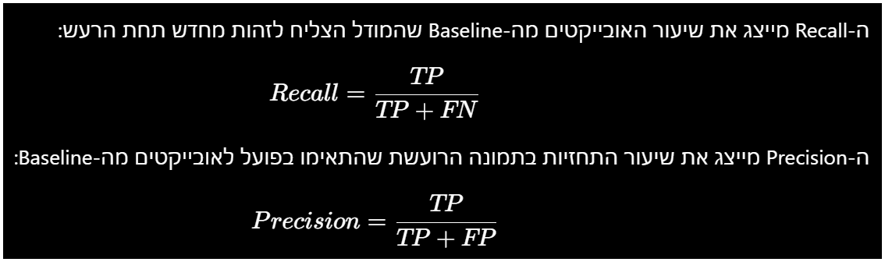

<em>Recall and precision definitions used in the Mask R-CNN analysis.</em>

The following graph shows the mean values across the five images. The red curve represents recall, and the dashed blue curve represents precision.

  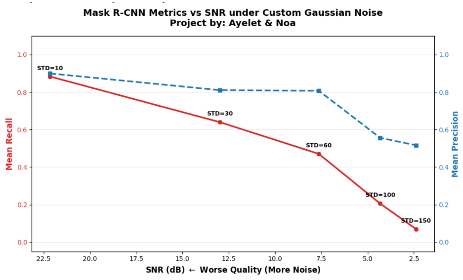

<em>Mean recall and precision as Gaussian-noise intensity increases.</em>

At `STD = 10`, recall is approximately `0.88` and precision is close to `0.90`. Most baseline objects remain detectable, and most predictions correspond to baseline objects.

At `STD = 30`, recall falls to approximately `0.64`, while precision remains near `0.80`. At `STD = 60`, recall decreases further to approximately `0.47`, while precision remains close to `0.80`. The dominant failure in this range is therefore the loss of real objects, reflected by an increase in false negatives.

At `STD = 100`, recall falls to approximately `0.21` and precision to approximately `0.55`. At `STD = 150`, recall reaches roughly `0.07`, while precision remains near `0.50`. Almost all clean-image objects are lost, and a substantial portion of the remaining predictions no longer matches the baseline.

The general trend is that recall degrades earlier and more sharply than precision. Gaussian noise initially causes objects to disappear. Only when the noise becomes extreme does it also produce a large increase in false or spatially inconsistent predictions.

## 7.8 Classical Enhancement for Gaussian Noise: Gaussian Blur

A `5 × 5` Gaussian low-pass filter was applied to reduce high-frequency noise before inference.

The filter smooths sharp variations between neighboring pixels. However, it cannot perfectly distinguish random noise from true image detail. It may therefore blur the same edges and textures that Mask R-CNN needs for detection and segmentation.

The following two graphs compare the distorted and enhanced images. In the recall graph, the red curve represents noisy inputs and the green curve represents Gaussian-blurred inputs. In the precision graph, the blue curve represents noisy inputs and the purple curve represents enhanced inputs.

  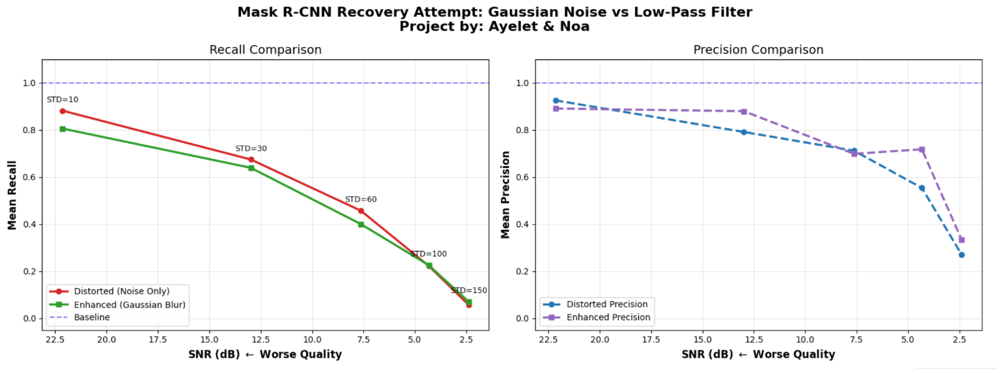

<em>Recall and precision before and after Gaussian-blur enhancement.</em>

The filter does not improve recall. At `STD = 10`, recall decreases from approximately `0.88` to `0.81`. At `STD = 30` and `STD = 60`, the enhanced recall also remains slightly below the unfiltered result.

The likely explanation is that the filter removes part of the noise but also removes real fine structure. Mask R-CNN can still use some of the original high-frequency information in the noisy image; uniform smoothing destroys part of that useful signal.

At `STD = 100` and `STD = 150`, the difference becomes small because both approaches already have very low recall. The structural damage is too severe for Gaussian blur to recover the lost objects.

Precision behaves differently. At `STD = 30`, precision increases from approximately `0.79` to `0.88`. At `STD = 100`, it increases from approximately `0.56` to approximately `0.72`. By suppressing artificial edges, the filter reduces some false predictions.

The improvement in precision comes at the cost of lower recall. Gaussian blur makes the model more conservative: it returns fewer incorrect predictions, but it also misses more real objects.

### 7.8.1 Exploratory Alpha-Blending Analysis

A second exploratory test blended the noisy image with the fully filtered image at several alpha values, including the extreme `STD = 150` condition.

  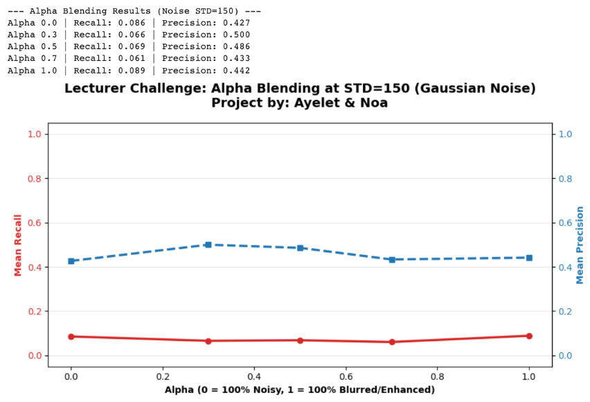

<em>Alpha-blending exploration under extreme Gaussian noise.</em>

The visual inspection shows that full filtering smooths the visible noise but may still leave or create positive detections that do not correspond reliably to the clean baseline.

  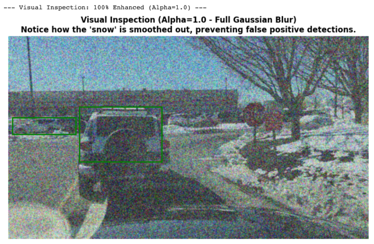

<em>Visual inspection of a fully blurred, heavily corrupted image.</em>

## 7.9 Deep-Learning-Based Improvement for Gaussian Noise

> **Work in progress:** the Mask R-CNN fine-tuning experiment for Gaussian noise has not yet been completed. This section will compare model adaptation against the Gaussian-blur preprocessing results.

## 7.10 Distortion 3: JPEG Compression

JPEG compression was evaluated as a lossy distortion associated with limited storage or communication bandwidth. Unlike Gaussian noise, JPEG removes high-frequency information and may create artificial boundaries between neighboring blocks.

The tested quality values were:

- `Q = 50`
- `Q = 30`
- `Q = 15`
- `Q = 5`
- `Q = 2`

Each RGB image was converted to BGR, encoded in memory using `cv2.imencode`, decoded using `cv2.imdecode`, and converted back to RGB. The clean image was used as the reference.

### 7.10.1 Visual Distortion Sweep

  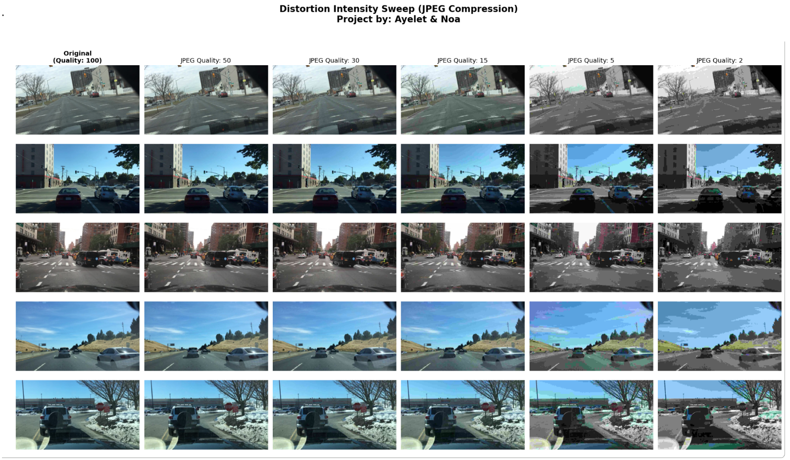

<em>JPEG-compression sweep used for Mask R-CNN evaluation.</em>

At `Q = 50` and `Q = 30`, the visual change is relatively mild. At `Q = 15`, fine texture and small edges become noticeably degraded. At `Q = 5` and `Q = 2`, large uniform color regions, artificial boundaries, and severe color changes appear. Small vehicles lose much of their shape and may merge into the road or background.

### 7.10.2 Mask R-CNN under JPEG Compression

  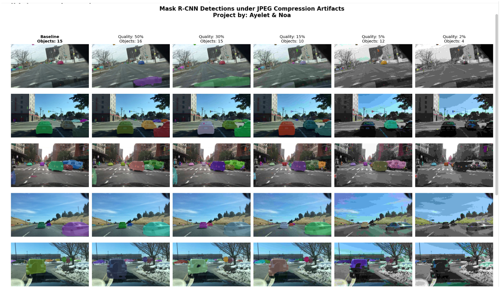

<em>Mask R-CNN predictions at different JPEG quality levels.</em>

Under mild compression, central objects and usable masks are largely preserved. As quality decreases, small and distant objects disappear, while the remaining masks become coarser and less aligned with the original boundaries.

For the first test image, the prediction counts were `15` at baseline, `16` at `Q = 50`, `15` at `Q = 30`, `10` at `Q = 15`, `12` at `Q = 5`, and `4` at `Q = 2`.

The apparent increase from ten objects at `Q = 15` to twelve objects at `Q = 5` does not represent real recovery. Severe compression can create artificial color patches and block boundaries that are interpreted as additional objects. Prediction count alone is therefore insufficient; spatial matching with the baseline is required.

## 7.11 Recall and Precision under JPEG Compression

As in the Gaussian-noise experiment, baseline and distorted bounding boxes were matched using `IoU > 0.5`. The red curve represents recall and the blue curve represents precision.

  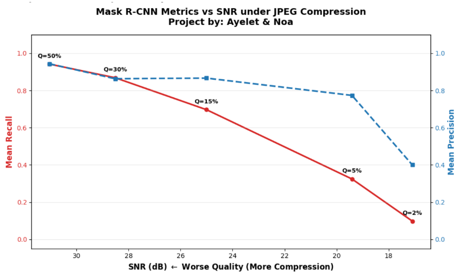

<em>Mean Mask R-CNN recall and precision under JPEG compression.</em>

At `Q = 50`, both recall and precision are approximately `0.94`, showing that moderate compression has little effect on the major objects. At `Q = 30`, both metrics decrease to approximately `0.87`, but the model remains relatively stable.

At `Q = 15`, recall falls to approximately `0.70`, while precision remains near `0.86`. The model begins to miss baseline objects, but most surviving predictions are still located correctly.

At `Q = 5`, recall collapses to approximately `0.33`, while precision remains near `0.77`. At `Q = 2`, recall reaches approximately `0.10` and precision falls to approximately `0.40`.

JPEG compression therefore affects recall first. Small and fragile objects disappear, while the remaining large predictions initially remain reliable. Under extreme compression, both localization reliability and prediction validity collapse.

## 7.12 Classical Enhancement for JPEG: Bilateral Filtering

A bilateral filter was applied using the following parameters:

- `d = 9`
- `sigmaColor = 75`
- `sigmaSpace = 75`

The filter combines spatial proximity with color similarity. Its purpose is to reduce artificial transitions caused by JPEG compression while preserving strong real edges.

For every image and quality level, the experiment:

1. Extracted the clean baseline boxes.
2. Compressed the image.
3. Ran Mask R-CNN on the compressed image.
4. Applied the bilateral filter to the same compressed image.
5. Ran Mask R-CNN on the enhanced image.
6. Matched both prediction sets to the baseline using `IoU > 0.5`.
7. Averaged recall and precision across the five images.

  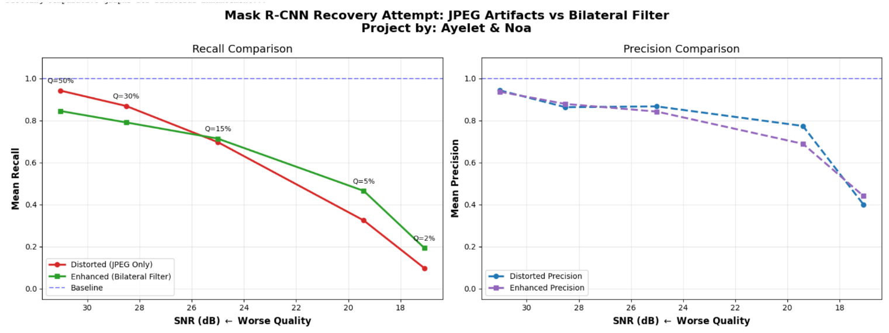

<em>Recall and precision before and after bilateral filtering of JPEG-compressed images.</em>

At `Q = 50` and `Q = 30`, the filter harms recall. At `Q = 50`, recall decreases from approximately `0.94` to `0.84`; at `Q = 30`, it decreases from approximately `0.87` to `0.79`. The images still contain useful natural details, and smoothing removes information that the model could otherwise exploit.

At `Q = 15`, both methods perform similarly, with a small advantage for filtering. At `Q = 5`, recall improves from approximately `0.33` to `0.47`. At `Q = 2`, it improves from approximately `0.10` to `0.19`.

The filter therefore recovers more objects when block artifacts are severe, but the enhanced results remain far below the clean baseline.

The precision response is not uniform. At `Q = 50`, precision remains close to `0.94`. At `Q = 30`, a small improvement appears. At `Q = 15`, the filtered precision is slightly lower. At `Q = 5`, the filter improves recall but reduces precision from approximately `0.77` to `0.69`, indicating that some of the additional predictions do not match baseline objects. At `Q = 2`, precision improves only slightly, from approximately `0.40` to `0.44`.

Bilateral filtering is therefore useful only conditionally. At mild compression it oversmooths valid features. At severe compression it may recover some objects, but this recovery can be accompanied by more false or spatially inconsistent predictions.

### 7.12.1 Exploratory Alpha-Blending Analysis

The report also includes an exploratory blending experiment at `Q = 5`, ranging from the fully compressed image to the fully bilaterally filtered image.

  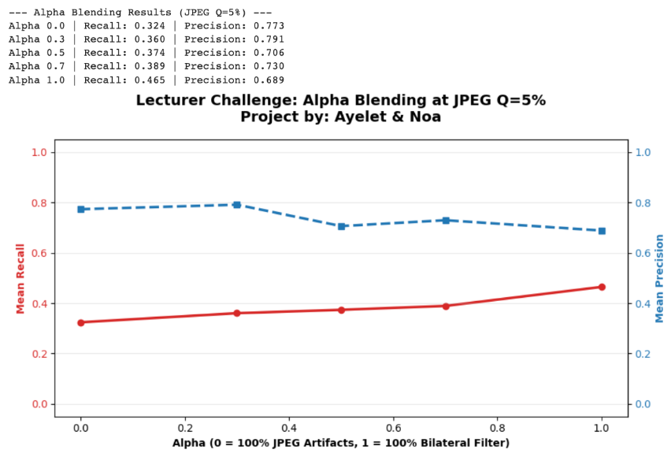

<em>Alpha-blending exploration for a severely JPEG-compressed image.</em>

The full-filter visual inspection shows that smoothing reduces block artifacts but may also spread regions and generate additional positive detections around strong edges.

  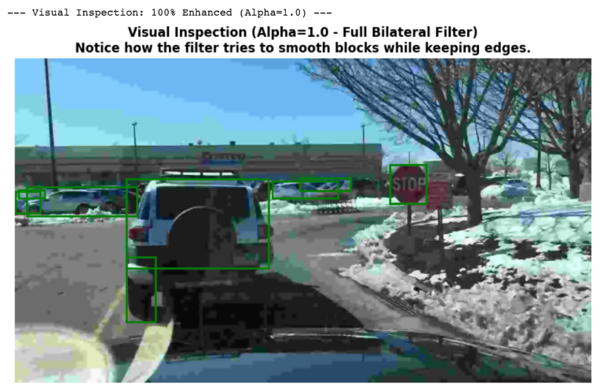

<em>Visual inspection after full bilateral filtering at severe JPEG compression.</em>

## 7.13 Deep-Learning-Based Improvement for JPEG Compression

> **Work in progress:** the Mask R-CNN fine-tuning experiment for JPEG compression has not yet been completed. The final version will compare learned robustness against bilateral preprocessing.

## 7.14 Task 2 Conclusion

Mask R-CNN is robust to mild image degradation but becomes increasingly unstable as local boundaries and textures are damaged. Across all three distortions, recall generally declines before precision. The model first loses small and distant objects while remaining relatively reliable on the large objects it continues to predict. Under severe corruption, both the number and spatial validity of predictions collapse.

Classical enhancement again produces a trade-off. Gamma and CLAHE do not substantially recover low-light masks and can damage fine contours. Gaussian blur lowers false predictions in some noisy conditions but reduces recall by erasing useful detail. Bilateral filtering improves recall under severe JPEG compression but may reduce precision and harms performance when compression is mild.

The incomplete fine-tuning sections are important because the Task 1 experiments suggest that model-level adaptation may outperform all of these fixed preprocessing methods. The final Task 2 report will test whether the same conclusion holds for instance segmentation.

---

# 8. Task 3: Monocular Depth Estimation with MiDaS

## 8.1 Task Overview

The third task evaluates the robustness of **MiDaS Small** for monocular depth estimation. Unlike the previous tasks, which return discrete boxes or object masks, MiDaS produces a continuous depth value for every pixel in the image.

This task complements object detection and instance segmentation. A driving system must not only identify vehicles, pedestrians, and road elements, but also estimate their spatial relationship and relative distance. Combining object identity with depth information is essential for collision warnings, autonomous-driving decisions, and scene understanding.

Each image was transformed using the preprocessing pipeline required by MiDaS. The predicted depth map was then resized to the original image dimensions using bicubic interpolation and normalized to the `[0, 1]` range for visualization and comparison.

MiDaS does **not** return metric distance in meters. It produces relative depth. In the Magma color map used in this report, brighter regions generally represent locations closer to the camera, while darker regions represent more distant locations.

## 8.2 Initial Clean Baseline

The following figure presents the five clean images and their corresponding MiDaS depth maps.

  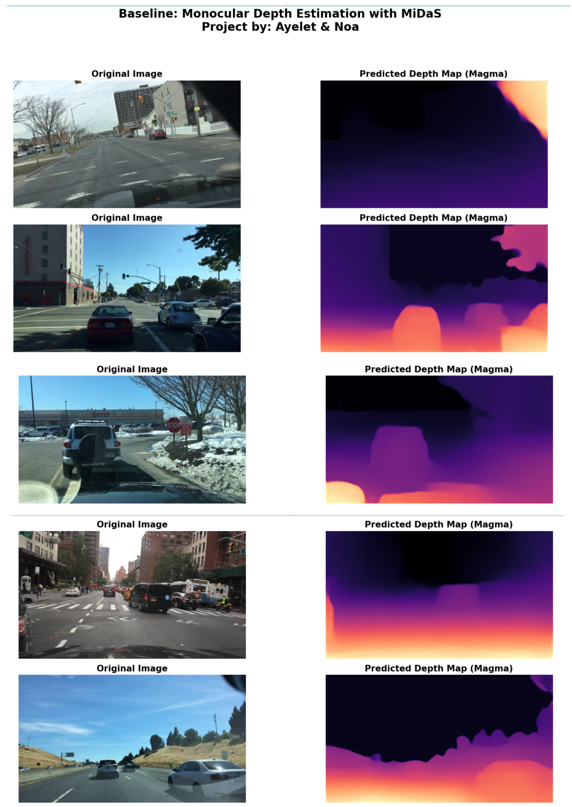

<em>Initial MiDaS depth estimates on the five clean test images.</em>

The model separates close and distant regions across the road scenes. Foreground vehicles generally receive brighter values, while distant road regions, buildings, and sky receive darker values.

However, the lower part of several images contains the hood of the camera vehicle. Because this region is extremely close to the camera, it can produce extreme depth values that dominate the normalization range and reduce visible contrast throughout the rest of the depth map.

## 8.3 Region-of-Interest Correction

To remove the influence of the ego vehicle, the upper `80%` of each image was defined as the region of interest, while the lower `20%` was masked in black.

The minimum and maximum values used for depth normalization were also calculated only from the region of interest. This prevents the extreme near-camera values from compressing the useful depth range of the road scene.

  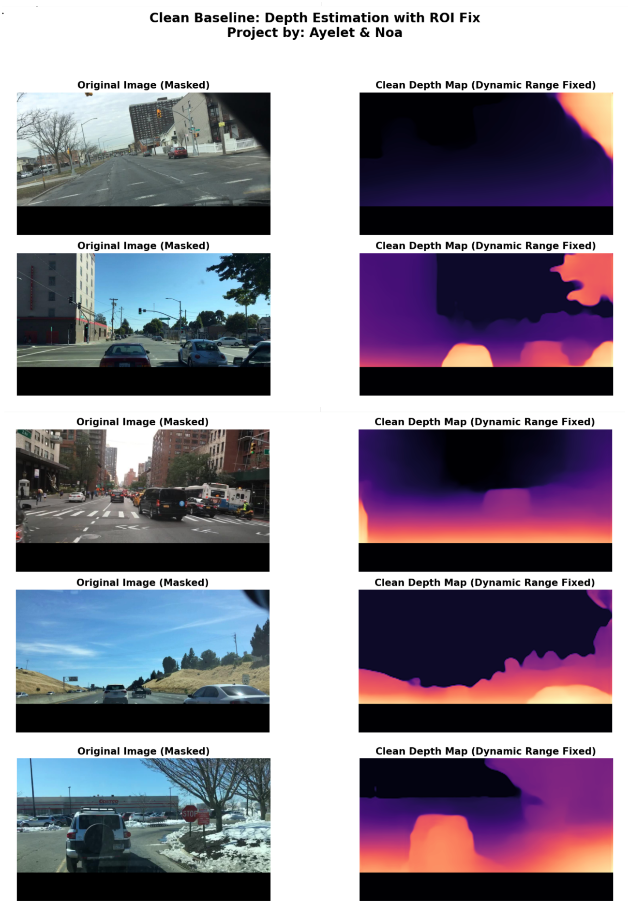

<em>ROI-corrected clean baseline with dynamic range calculated from the upper 80% of each image.</em>

The corrected baseline provides clearer separation between the road, vehicles, buildings, and background. It is used as the visual and quantitative reference for all later MiDaS experiments.

## 8.4 Distortion 1: Low-Light Conditions

The low-light distortion was generated in the HSV color space by multiplying the value channel by a factor below `1.0`. This reduces illumination while approximately preserving hue and saturation.

A factor of `1.0` represents the original image. Smaller factors represent stronger darkness.

### 8.4.1 Visual Distortion Sweep

  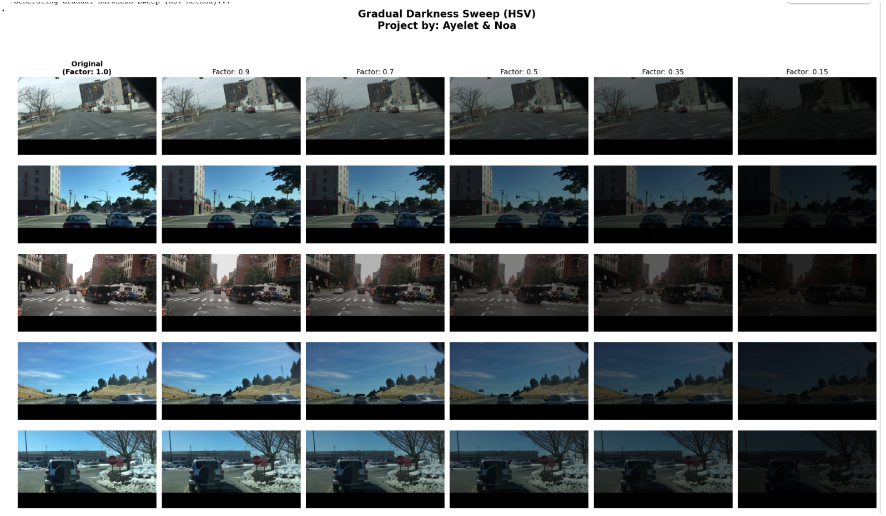

<em>Gradual low-light sweep used for MiDaS evaluation.</em>

At factor `0.9`, most details remain visible. At factors `0.7` and `0.5`, local contrast weakens and shadowed details begin to disappear. At `0.35` and `0.15`, vehicles, lane markings, and distant structures lose a substantial portion of their visual cues.

Unlike Gaussian noise, this transformation does not add random information. It attenuates the original signal, making the structural cues used by MiDaS increasingly weak.

### 8.4.2 Depth Maps under Low Light

  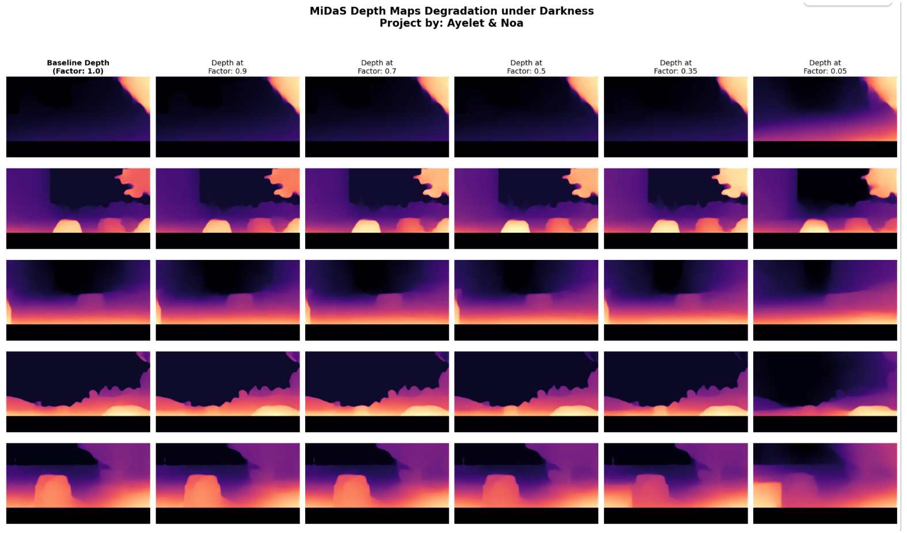

<em>MiDaS depth maps under increasing low-light distortion.</em>

At mild darkness, the global depth structure is preserved. Close and distant regions remain in locations similar to the clean baseline. As darkness becomes more severe, transitions between depth regions change and boundaries become less sharp.

Under strong darkness, some depth maps become smoother and more spatially uniform. MiDaS continues to generate a complete output, but local structure and relative depth transitions become increasingly different from the clean result.

## 8.5 RMSE Evaluation under Low Light

The depth difference was quantified using root mean squared error:

\[
\mathrm{RMSE}=\sqrt{\frac{1}{N}\sum_{i=1}^{N}(D_i-\hat{D}_i)^2}
\]

A lower value indicates stronger agreement with the clean baseline.

  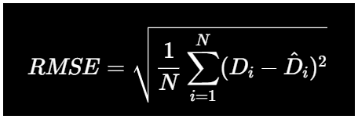

<em>RMSE definition used for depth-map comparison.</em>

The following graph shows the mean RMSE as darkness increases.

  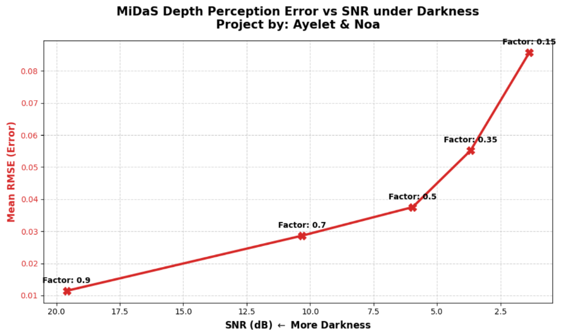

<em>Mean MiDaS depth error as the low-light SNR decreases.</em>

At factor `0.9`, the mean error is approximately `0.01`, indicating almost no change from the clean baseline. At factor `0.7`, the error increases to approximately `0.028`, and at factor `0.5` to approximately `0.037`.

At factor `0.35`, RMSE reaches approximately `0.055`. At factor `0.15`, it reaches approximately `0.085`. The increasing error shows that MiDaS is relatively stable under mild darkness but progressively loses depth consistency as the visible signal becomes weaker.

Unlike an object detector, MiDaS does not stop returning predictions. It continues to produce a full depth map even under difficult conditions. The failure therefore appears as a gradual loss of accuracy and structure rather than as a complete absence of output.

## 8.6 Classical Enhancement for Low Light: CLAHE

CLAHE was applied before MiDaS inference to determine whether local contrast recovery could improve the depth maps.

Each RGB image was converted to LAB. CLAHE was applied only to the luminance channel using:

- `clipLimit = 3.0`
- `tileGridSize = 8 × 8`

The color channels were preserved without direct equalization. MiDaS was then run again, and the enhanced depth maps were compared with the clean baseline using RMSE and SSIM.

The following figure presents both comparisons. In the RMSE graph, the red curve represents the distorted images and the green curve represents CLAHE. In the SSIM graph, the blue curve represents the distorted images and the green curve represents CLAHE.

  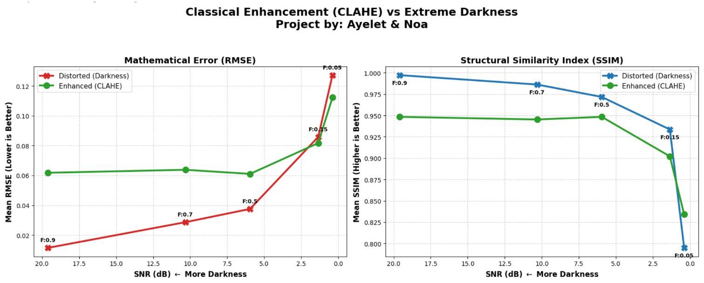

<em>RMSE and SSIM before and after CLAHE under low-light conditions.</em>

At mild and moderate darkness, CLAHE worsens the result. At factor `0.9`, the distorted image has an RMSE of approximately `0.01`, while CLAHE increases it to approximately `0.06`. Similar behavior appears at factors `0.7` and `0.5`.

When sufficient visual information remains, increasing local contrast changes textures, boundaries, and brightness relationships that MiDaS already interprets successfully. The enhanced depth map therefore becomes less similar to the clean baseline.

At stronger darkness, the benefit begins to increase. At factor `0.15`, the two methods become closer. At the additional extreme evaluation point `0.05`, RMSE decreases from approximately `0.13` without enhancement to approximately `0.11` after CLAHE.

The SSIM graph supports the same conclusion. At factor `0.9`, the unenhanced depth map remains close to `1.0`, whereas CLAHE reduces structural similarity to approximately `0.95`. The unenhanced map also performs better at factors `0.7` and `0.5`.

Only at the extreme factor `0.05` does CLAHE produce a measurable SSIM improvement, from approximately `0.80` to approximately `0.83`. The gain is real but limited, and the enhanced map remains far from the clean baseline.

CLAHE is therefore not appropriate as a universal preprocessing stage. It damages already usable images and becomes beneficial only when the original contrast has nearly disappeared.

## 8.7 Deep-Learning-Based Improvement for Low Light

> **Work in progress:** the deep-learning robustness experiment for MiDaS under low-light conditions has not yet been completed. It will be added after training and evaluation are finalized.

## 8.8 Distortion 2: Gaussian Noise

Gaussian noise was added to evaluate whether MiDaS can preserve a stable continuous depth field when the image contains random sensor-like fluctuations.

For every image, zero-mean Gaussian noise with standard deviation `sigma` was added to the RGB pixels and clipped to `[0, 255]`. Five levels were tested:

- `sigma = 15`
- `sigma = 30`
- `sigma = 50`
- `sigma = 75`
- `sigma = 100`

The bottom `20%` of every image was masked to preserve the same region of interest used in the baseline.

### 8.8.1 Visual Distortion Sweep

  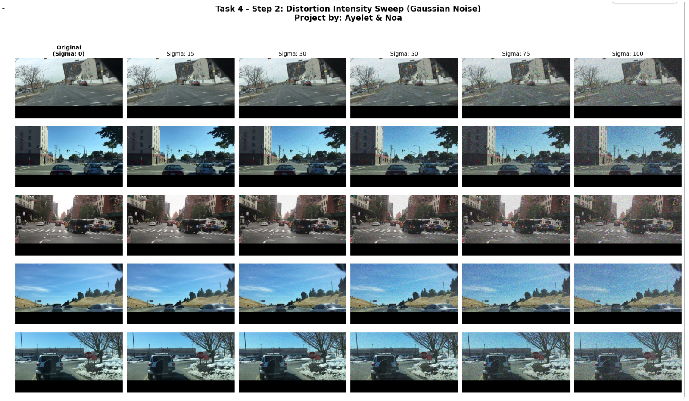

<em>Gaussian-noise sweep for the MiDaS experiment.</em>

At `sigma = 15`, the visual effect is moderate and the road geometry remains clear. At `sigma = 30` and `sigma = 50`, color grain increasingly damages texture and edges. At `sigma = 75` and `sigma = 100`, the random component becomes dominant and makes it difficult to distinguish true boundaries from pixel fluctuations.

### 8.8.2 Depth Maps under Gaussian Noise

  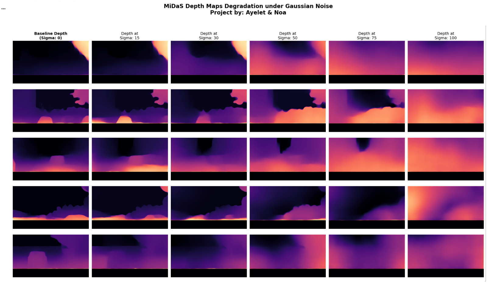

<em>MiDaS depth maps under increasing Gaussian noise.</em>

At `sigma = 15` and `sigma = 30`, the global depth structure remains reasonably similar to the clean baseline. At `sigma = 50`, transitions between near and far regions become less stable, and boundaries begin to smooth or deform.

At `sigma = 75` and `sigma = 100`, broad regions receive similar depth values, local details disappear, and the model has greater difficulty separating vehicles, road, and background. MiDaS continues to return a complete map, but the result becomes both numerically and structurally less reliable.

## 8.9 RMSE and SSIM under Gaussian Noise

The noisy depth maps were compared with the clean baseline within the upper `80%` ROI. Two metrics were used:

- **RMSE**, where lower is better.
- **SSIM**, where a value closer to `1` indicates stronger structural preservation.

The following figure presents the mean values across the five test images. The red curve shows RMSE, and the blue curve shows SSIM.

  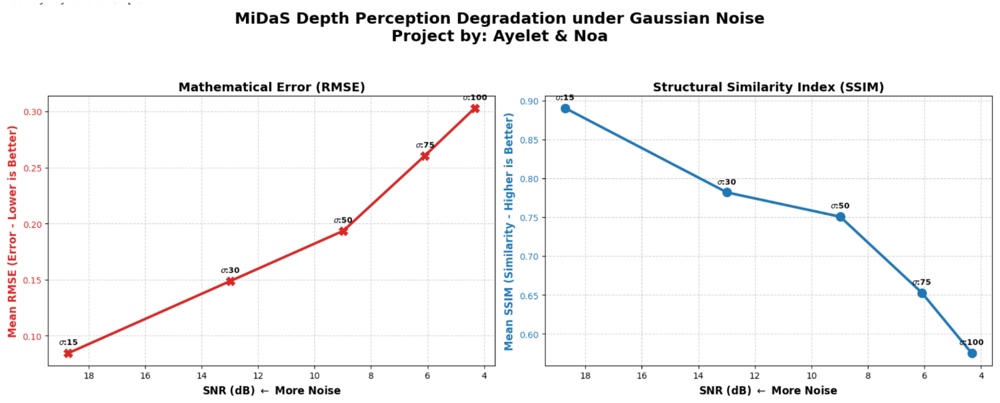

<em>MiDaS depth degradation under Gaussian noise.</em>

RMSE increases consistently with noise intensity. It is approximately `0.085` at `sigma = 15`, `0.15` at `sigma = 30`, `0.19` at `sigma = 50`, `0.26` at `sigma = 75`, and `0.30` at `sigma = 100`.

The continuous increase shows that every additional level of noise moves the depth map farther from the clean baseline. The stronger changes at `sigma = 75` and `sigma = 100` indicate that the noise is no longer affecting only local details; it is changing the broad depth distribution of the scene.

SSIM falls from approximately `0.89` at `sigma = 15` to `0.78` at `sigma = 30`, `0.75` at `sigma = 50`, `0.65` at `sigma = 75`, and `0.58` at `sigma = 100`.

The two metrics lead to the same conclusion. MiDaS has some tolerance to mild noise, but both numerical accuracy and spatial structure degrade substantially at moderate and high intensities.

## 8.10 Classical Enhancement for Gaussian Noise: Gaussian Blur

A Gaussian blur was applied using a `7 × 7` kernel and standard deviation `1.5`. The filter acts as a low-pass operation, reducing rapid pixel-to-pixel changes that characterize Gaussian noise.

A fixed random seed of `42` was used in the enhancement experiment to generate reproducible noise samples and support a consistent comparison between noisy and filtered images.

For every noise level, MiDaS was run once on the noisy image and once after Gaussian blur. Both outputs were compared with the clean baseline using RMSE and SSIM.

  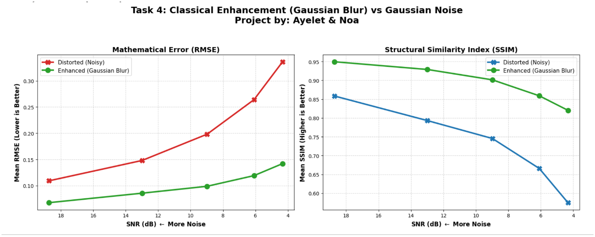

<em>MiDaS RMSE and SSIM before and after Gaussian-blur denoising.</em>

In the RMSE graph, the green enhanced curve is below the red noisy curve at every noise level. The error decreases from approximately `0.11` to `0.07` at the lowest noise level, from `0.15` to `0.085` at `sigma = 30`, and from `0.20` to `0.10` at `sigma = 50`.

At the severe levels, the improvement is even larger. RMSE decreases from approximately `0.27` to `0.12` at `sigma = 75`, and from approximately `0.34` to `0.14` at `sigma = 100`.

In the SSIM graph, the green curve is above the blue curve at every point. SSIM improves from approximately `0.86` to `0.95` at the lowest level, from `0.79` to `0.93` at `sigma = 30`, and from `0.75` to `0.90` at `sigma = 50`. At `sigma = 75`, it improves from approximately `0.67` to `0.86`; at `sigma = 100`, from approximately `0.58` to `0.82`.

This is the clearest classical-enhancement success in the project. Gaussian noise is dominated by high-frequency spatial components, so low-pass filtering directly targets the main distortion mechanism. The filter removes random fluctuations and allows MiDaS to recover more of the global scene structure.

The enhanced results do not fully return to the clean baseline. Lost details cannot be reconstructed perfectly, but Gaussian blur nevertheless provides a strong and consistent preprocessing improvement for this specific model-distortion combination.

## 8.11 Deep-Learning-Based Improvement for Gaussian Noise

> **Work in progress:** the deep-learning improvement stage for MiDaS under Gaussian noise has not yet been completed. The classical result provides a strong baseline against which the learned method will be evaluated.

## 8.12 Distortion 3: JPEG Compression

The final MiDaS experiment evaluated lossy JPEG compression. Fine textures, small edges, and color transitions are progressively removed as the compression becomes stronger.

Each image was converted from RGB to BGR, encoded as JPEG in memory at the selected quality, decoded, and converted back to RGB. Five quality levels were tested:

- `Q = 30`
- `Q = 20`
- `Q = 10`
- `Q = 5`
- `Q = 2`

The clean image was treated as quality `100`. The bottom `20%` of each image was excluded to preserve a consistent ROI.

### 8.12.1 Visual Distortion Sweep

  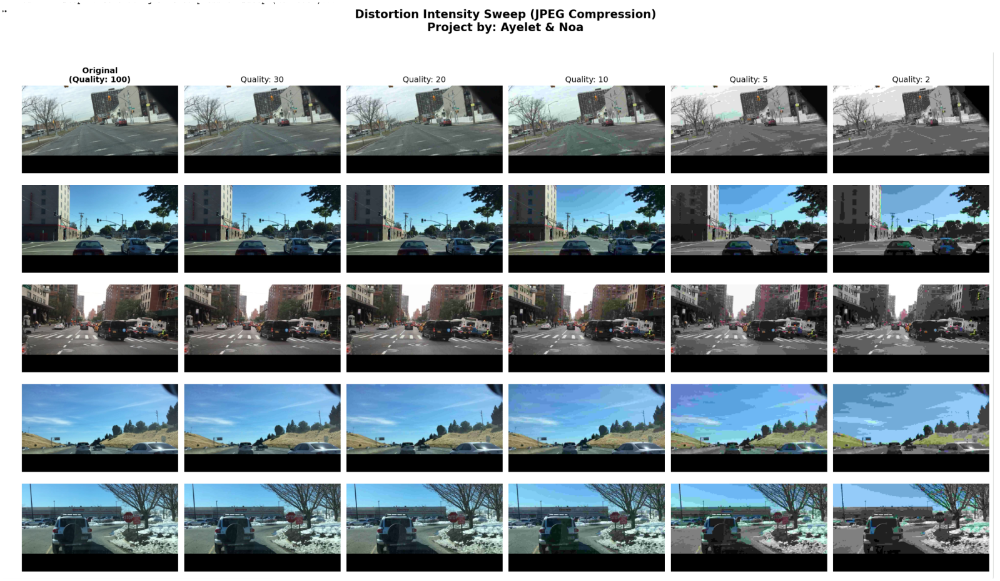

<em>JPEG-compression sweep for MiDaS evaluation.</em>

At `Q = 30` and `Q = 20`, the scene structure is largely preserved, with degradation concentrated in small details and texture. At `Q = 10`, color transitions and contours become visibly less natural. At `Q = 5` and `Q = 2`, broad flat color regions, artificial boundaries, and coarse object contours dominate the image.

Unlike Gaussian noise, JPEG compression removes part of the original information. Once fine details have been discarded by the encoder, a simple filter cannot reconstruct them exactly.

### 8.12.2 Depth Maps under JPEG Compression

  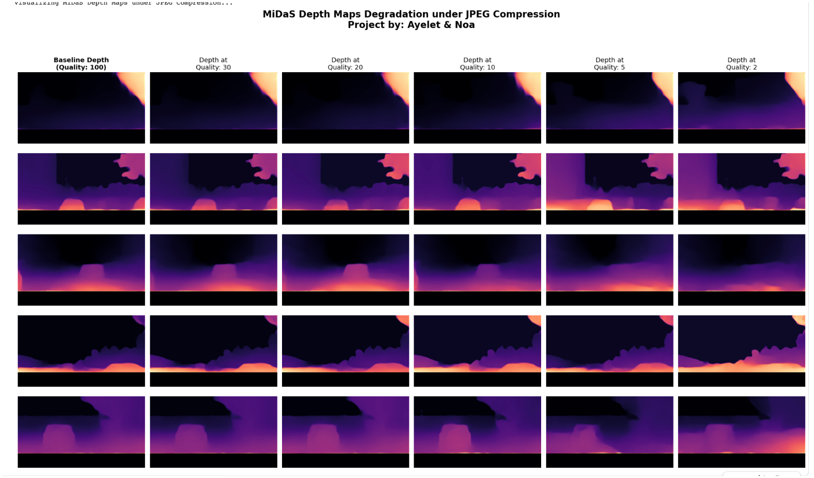

<em>MiDaS depth maps at decreasing JPEG quality levels.</em>

At `Q = 30` and `Q = 20`, the maps remain very similar to the clean baseline. At `Q = 10`, the central scene structure is still preserved, but local boundaries and values begin to change.

At `Q = 5`, near regions expand or change shape, and near-far transitions become less accurate. At `Q = 2`, the changes are more severe, especially in regions where compression has removed texture or produced artificial boundaries.

MiDaS continues to produce a full depth map even at the most severe level, but the output moves progressively farther from the baseline.

## 8.13 RMSE and SSIM under JPEG Compression

The depth maps were compared within the upper `80%` ROI using RMSE and SSIM.

The following figure presents both mean metrics. The red curve represents RMSE, and the blue curve represents SSIM.

  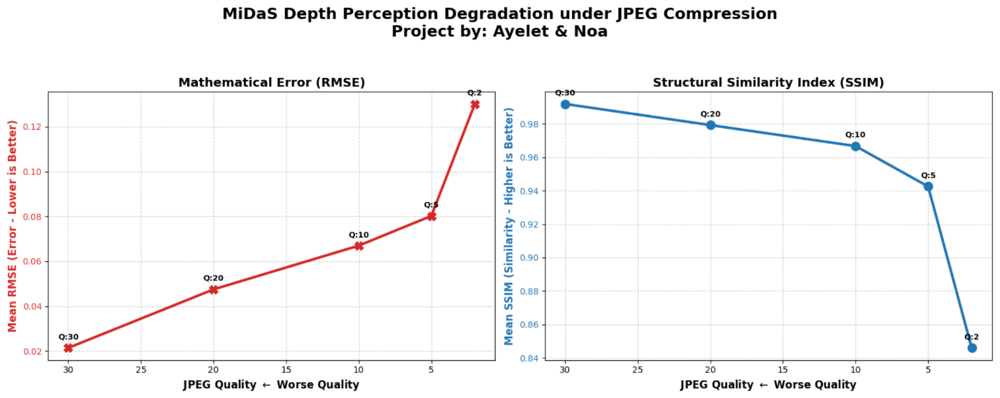

<em>MiDaS depth degradation under JPEG compression.</em>

RMSE increases from approximately `0.02` at `Q = 30` to `0.048` at `Q = 20`, `0.067` at `Q = 10`, and `0.08` at `Q = 5`. At `Q = 2`, the error jumps sharply to approximately `0.13`.

The gradual increase through `Q = 5` shows that MiDaS can tolerate some information loss. The sharp increase between `Q = 5` and `Q = 2` indicates a failure point at which the compression destroys visual cues that are important for depth estimation.

SSIM is approximately `0.99` at `Q = 30`, `0.98` at `Q = 20`, `0.97` at `Q = 10`, and `0.94` at `Q = 5`. At `Q = 2`, it falls sharply to approximately `0.85`.

MiDaS therefore preserves global depth structure well under mild and moderate compression. Extreme compression produces both a strong numerical error and a substantial loss of structural similarity.

## 8.14 Classical Enhancement for JPEG: Gaussian Blur

A Gaussian blur with a `7 × 7` kernel and standard deviation `1.5` was applied before MiDaS inference. The purpose was to smooth artificial compression boundaries and reduce the influence of severe block artifacts.

  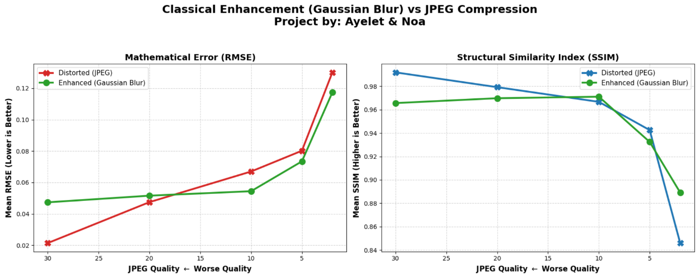

<em>MiDaS RMSE and SSIM before and after Gaussian blur on JPEG-compressed images.</em>

At `Q = 30`, the filter harms the result: RMSE increases from approximately `0.02` to `0.048`. A smaller penalty also appears at `Q = 20`. Under moderate compression, the image still contains useful edges and texture, and blurring removes information that MiDaS could otherwise exploit.

At `Q = 10`, the direction changes. RMSE decreases from approximately `0.067` to `0.054`. At `Q = 5`, it decreases from approximately `0.08` to `0.073`, and at `Q = 2` from approximately `0.13` to `0.117`.

The SSIM behavior is more nuanced. At `Q = 30` and `Q = 20`, the unfiltered maps preserve structure better. At `Q = 10`, filtering produces a small improvement. At `Q = 5`, RMSE improves while SSIM becomes slightly worse, showing that numerical closeness and local structural similarity do not always change together.

At `Q = 2`, the strongest structural benefit appears: SSIM increases from approximately `0.85` to `0.89`. At this extreme level, smoothing the dominant artificial boundaries helps MiDaS recover part of the broad depth layout.

Gaussian blur is therefore not uniformly beneficial for JPEG compression. It damages useful information under mild compression but can reduce numerical error when block artifacts become severe. An adaptive decision rule would be required before applying it in a real system.

## 8.15 Deep-Learning-Based Improvement for JPEG Compression

> **Work in progress:** the deep-learning robustness experiment for MiDaS under JPEG compression has not yet been completed. It will be added in a later update.

## 8.16 Task 3 Conclusion

MiDaS differs from the discrete detection models because it continues to produce a full output even under severe distortion. Its degradation is therefore measured as a continuous change in numerical error and spatial structure rather than as a simple disappearance of predictions.

The model is relatively stable under mild darkness and mild-to-moderate JPEG compression. Gaussian noise produces a stronger continuous degradation, but it is also the distortion for which classical preprocessing is most successful. Gaussian blur consistently improves both RMSE and SSIM under Gaussian noise because the filter directly suppresses the high-frequency component responsible for the corruption.

CLAHE under low light and Gaussian blur under JPEG compression both exhibit a severity-dependent trade-off. They damage the result when the original image remains usable and become beneficial only under extreme degradation. These findings again demonstrate that fixed preprocessing should not be applied blindly.

---

# 9. Overall Conclusions

This project evaluates three computer-vision models under non-ideal imaging conditions: YOLOv8 for object detection, Mask R-CNN for instance segmentation, and MiDaS for monocular depth estimation. For every model, a clean-image baseline was established and compared with three progressively stronger distortions: low light, Gaussian noise, and JPEG compression.

The results show that lower image quality affects each task differently. YOLOv8 loses detections, confidence, and sometimes class identity. Mask R-CNN loses objects and produces less accurate or less stable spatial masks. MiDaS continues to return a complete depth field, but its numerical accuracy and structural consistency degrade.

Classical preprocessing methods, including CLAHE, Gaussian blur, and bilateral filtering, demonstrate a clear trade-off. At mild distortion levels, they may reduce performance by blurring real edges, altering texture, or amplifying background artifacts. At stronger distortion levels, they can sometimes suppress the dominant corruption, reduce false predictions, recover a limited number of objects, or improve depth-map similarity.

The strongest classical result is obtained for MiDaS under Gaussian noise, where Gaussian blur consistently lowers RMSE and raises SSIM. This success occurs because the distortion and enhancement are well matched: additive Gaussian noise contains strong high-frequency components, and a low-pass filter directly suppresses them.

The completed YOLOv8 experiments show that fine-tuning on distorted data is significantly more effective and stable than external preprocessing. The adapted detector learns internal features that are less dependent on fragile color, texture, and clean edges. It preserves high recall at distortion levels that cause the original and enhanced models to collapse.

The central engineering conclusion is that there is no single preprocessing operation that is optimal for every model and distortion. A robust vision system should estimate the type and severity of the input degradation, select enhancement only when its expected benefit exceeds its cost, and, whenever possible, include representative real-world distortions during model training.

# 10. Current Limitations and Future Work

The project is still being completed. Fine-tuning has been evaluated for the YOLOv8 experiments, while the corresponding deep-learning improvement stages for Mask R-CNN and MiDaS remain under development. The placeholders in this README identify the exact positions where those results will be inserted.

Additional methodological considerations include:

- The clean-model outputs are used as experimental reference predictions. They are not manually annotated ground-truth labels.
- The Mask R-CNN quantitative graphs use bounding-box IoU matching to measure object-detection stability. They do not directly measure pixel-level mask IoU.
- MiDaS produces relative rather than metric depth.
- Each MiDaS depth map is normalized independently using the selected ROI. The metrics therefore emphasize relative depth structure rather than absolute scale.
- Some distortion and enhancement experiments use slightly different extreme parameter values. The final report should standardize these grids where direct point-by-point comparison is required.
- Reproducible random seeds should be applied consistently across all Gaussian-noise experiments in the final code release.

Future work will complete the Mask R-CNN and MiDaS fine-tuning experiments, add a final cross-model comparison, and evaluate whether a distortion-aware adaptive pipeline can automatically choose between direct inference, classical enhancement, and a specialized robust model.

## Authors

**Ayelet & Noa**
